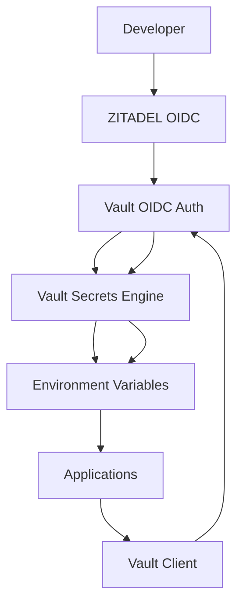

# 🔐 HashiCorp Vault + ZITADEL: Enterprise Implementation

> Complete enterprise-grade environment variable management with HashiCorp Vault and ZITADEL

## 📋 Table of Contents

- [Overview](#-overview)
- [Architecture](#-architecture)
- [Prerequisites](#-prerequisites)
- [Installation & Setup](#-installation--setup)
- [Configuration](#-configuration)
- [Development Tools](#-development-tools)
- [CI/CD Integration](#-cicd-integration)
- [Security Features](#-security-features)
- [Advanced Features](#-advanced-features)
- [Troubleshooting](#-troubleshooting)
- [Best Practices](#-best-practices)

## 🎯 Overview

This document provides a complete implementation guide for enterprise environment variable management using HashiCorp Vault as the secrets management system and ZITADEL as the identity provider.

### Why HashiCorp Vault + ZITADEL?

- **🔐 Zero Trust Security**: No direct access to secrets, identity-based authentication
- **🏢 Enterprise Grade**: Designed for large organizations with complex security requirements
- **🌐 Multi-Cloud**: Works across any cloud provider or on-premises
- **🔄 Self-Hosted**: Complete control over your identity and secrets infrastructure
- **📊 Compliance**: Built-in audit logging and compliance features
- **🛠️ Developer Experience**: Excellent tooling and integration options

### Key Benefits

```typescript
interface VaultZitadelBenefits {
  security: {
    zeroTrust: boolean;           // No direct access to secrets
    identityBased: boolean;       // Authentication via ZITADEL
    encryptionAtRest: boolean;    // All secrets encrypted
    auditLogging: boolean;        // Complete audit trail
  };
  
  flexibility: {
    multiCloud: boolean;          // Works anywhere
    selfHosted: boolean;          // Complete control
    vendorNeutral: boolean;       // No lock-in
    customizable: boolean;         // Full customization
  };
  
  developerExperience: {
    singleSignOn: boolean;        // One login for everything
    environmentSelection: boolean; // Visual environment picker
    automaticSync: boolean;       // Real-time updates
    tooling: boolean;             // Excellent CLI and UI tools
  };
}
```

## 🏗️ Architecture

### High-Level Architecture



### Detailed Component Architecture

```typescript
interface VaultZitadelArchitecture {
  // Identity Layer (ZITADEL)
  identity: {
    authentication: {
      provider: 'zitadel-oidc';
      flow: 'authorization-code-pkce';
      scopes: ['openid', 'profile', 'email', 'vault:read', 'vault:write'];
    };
    
    authorization: {
      roleBased: boolean;
      granularPermissions: boolean;
      timeBasedAccess: boolean;
      auditLogging: boolean;
    };
  };
  
  // Secrets Layer (Vault)
  secrets: {
    storage: {
      engine: 'kv-v2';
      encryption: 'aes-256-gcm';
      namespaces: ['dev', 'staging', 'prod'];
    };
    
    access: {
      authentication: 'oidc';
      authorization: 'policies';
      audit: 'comprehensive';
    };
    
    features: {
      dynamicSecrets: boolean;
      secretRotation: boolean;
      keyManagement: boolean;
      encryption: boolean;
    };
  };
  
  // Application Layer
  applications: {
    integration: {
      sdk: 'node-vault';
      authentication: 'automatic';
      caching: 'memory';
    };
    
    development: {
      cli: 'custom-tools';
      vscode: 'extension';
      hotReload: boolean;
    };
  };
}
```

## 📋 Prerequisites

### System Requirements

```bash
# Minimum system requirements
- CPU: 2 cores
- RAM: 4GB
- Storage: 20GB
- OS: Linux, macOS, or Windows
- Network: Internet access for ZITADEL
```

### Software Requirements

```bash
# Required software
- Bun: ^1.0.0
- Node.js: ^18.0.0
- Docker: ^20.0.0 (optional, for containerized deployment)
- Git: ^2.0.0
```

### Network Requirements

```bash
# Network configuration
- Vault API: 8200 (HTTP) / 8201 (HTTPS)
- ZITADEL API: 443 (HTTPS)
- OIDC endpoints: 443 (HTTPS)
- Development ports: 3000-3010
```

## 🚀 Installation & Setup

### Step 1: Install HashiCorp Vault

```bash
# macOS (using Homebrew)
brew install vault

# Linux (using package manager)
curl -fsSL https://apt.releases.hashicorp.com/gpg | sudo apt-key add -
sudo apt-add-repository "deb [arch=amd64] https://apt.releases.hashicorp.com $(lsb_release -cs) main"
sudo apt-get update && sudo apt-get install vault

# Windows (using Chocolatey)
choco install vault

# Verify installation
vault version
```

### Step 2: Install ZITADEL

```bash
# Self-hosted ZITADEL (recommended for enterprise)
git clone https://github.com/zitadel/zitadel.git
cd zitadel
docker-compose up -d

# Or use ZITADEL Cloud (managed service)
# Visit https://cloud.zitadel.com to create account
```

### Step 3: Install Development Dependencies

```bash
# Install required packages
bun add node-vault @zitadel/nodejs-sdk
bun add -D @types/node

# Install CLI tools
bun add -g @repo/env-cli
```

### Step 4: Initialize Vault

```bash
# Start Vault server (development mode)
vault server -dev

# In another terminal, initialize Vault
export VAULT_ADDR='http://127.0.0.1:8200'
vault status

# Enable OIDC auth method
vault auth enable oidc

# Enable KV secrets engine
vault secrets enable -path=secret kv-v2

# Create namespaces for different environments
vault namespace create dev
vault namespace create staging
vault namespace create prod
```

## ⚙️ Configuration

### Step 1: Configure ZITADEL

```typescript
// packages/auth-provider/src/zitadel-config.ts
export interface ZitadelConfig {
  issuer: string;
  clientId: string;
  clientSecret: string;
  redirectUri: string;
  scopes: string[];
}

export const defaultZitadelConfig: ZitadelConfig = {
  issuer: process.env.ZITADEL_ISSUER!,
  clientId: process.env.ZITADEL_CLIENT_ID!,
  clientSecret: process.env.ZITADEL_CLIENT_SECRET!,
  redirectUri: 'http://localhost:20314/auth/callback',
  scopes: [
    'openid',
    'profile', 
    'email',
    'vault:read',
    'vault:write'
  ],
};
```

### Step 2: Configure Vault OIDC Authentication

```bash
# Configure OIDC auth method in Vault
vault write auth/oidc/config \
  oidc_discovery_url="https://your-zitadel-instance.com/.well-known/openid-configuration" \
  oidc_client_id="your-client-id" \
  oidc_client_secret="your-client-secret" \
  default_role="default"

# Create OIDC role
vault write auth/oidc/role/default \
  user_claim="sub" \
  allowed_redirect_uris="http://localhost:20314/auth/callback" \
  policies="default" \
  ttl=1h
```

### Step 3: Create Vault Policies

```hcl
# policies/default.hcl
path "secret/data/turboobun/*" {
  capabilities = ["read", "list"]
}

path "secret/data/turboobun/development/*" {
  capabilities = ["read", "write", "delete"]
}

path "secret/data/turboobun/staging/*" {
  capabilities = ["read", "write"]
}

path "secret/data/turboobun/production/*" {
  capabilities = ["read"]
}
```

```bash
# Apply policies to Vault
vault policy write default policies/default.hcl
```

### Step 4: Environment Configuration

```bash
# .env.local
VAULT_ADDR=http://localhost:8200
VAULT_TOKEN=your-vault-token
ZITADEL_ISSUER=https://your-zitadel-instance.com
ZITADEL_CLIENT_ID=your-client-id
ZITADEL_CLIENT_SECRET=your-client-secret
```

## 🛠️ Development Tools

### 1. Core Integration Library

```typescript
// packages/vault-zitadel/src/core.ts
import { Client } from 'node-vault';
import { ZitadelClient } from '@zitadel/nodejs-sdk';

export class VaultZitadelCore {
  private vaultClient: Client;
  private zitadelClient: ZitadelClient;
  private currentToken: string | null = null;
  
  constructor() {
    this.vaultClient = new Client({
      apiVersion: 'v1',
      endpoint: process.env.VAULT_ADDR!,
    });
    
    this.zitadelClient = new ZitadelClient({
      issuer: process.env.ZITADEL_ISSUER!,
      clientId: process.env.ZITADEL_CLIENT_ID!,
      clientSecret: process.env.ZITADEL_CLIENT_SECRET!,
    });
  }
  
  async authenticate(): Promise<void> {
    try {
      // Get OIDC token from ZITADEL
      const tokens = await this.zitadelClient.getTokens();
      
      // Authenticate with Vault using OIDC token
      const authResult = await this.vaultClient.auths({
        method: 'POST',
        path: 'auth/oidc/login',
        data: {
          role: 'default',
          jwt: tokens.idToken,
        },
      });
      
      this.currentToken = authResult.auth.client_token;
      this.vaultClient.token = this.currentToken;
      
      console.log('✅ Authenticated with Vault via ZITADEL');
    } catch (error) {
      console.error('❌ Authentication failed:', error);
      throw error;
    }
  }
  
  async getEnvironmentVariables(environment: string): Promise<Record<string, string>> {
    if (!this.currentToken) {
      await this.authenticate();
    }
    
    try {
      const response = await this.vaultClient.read(`secret/data/turboobun/${environment}`);
      return response.data.data || {};
    } catch (error) {
      console.error(`Failed to get secrets for ${environment}:`, error);
      throw error;
    }
  }
  
  async setEnvironmentVariable(environment: string, key: string, value: string): Promise<void> {
    if (!this.currentToken) {
      await this.authenticate();
    }
    
    try {
      // Get existing variables
      const existing = await this.getEnvironmentVariables(environment);
      
      // Update with new variable
      const updated = { ...existing, [key]: value };
      
      await this.vaultClient.write(`secret/data/turboobun/${environment}`, {
        data: updated,
      });
      
      console.log(`✅ Set ${key} for ${environment}`);
    } catch (error) {
      console.error(`Failed to set secret ${key} for ${environment}:`, error);
      throw error;
    }
  }
  
  async deleteEnvironmentVariable(environment: string, key: string): Promise<void> {
    if (!this.currentToken) {
      await this.authenticate();
    }
    
    try {
      const existing = await this.getEnvironmentVariables(environment);
      delete existing[key];
      
      await this.vaultClient.write(`secret/data/turboobun/${environment}`, {
        data: existing,
      });
      
      console.log(`✅ Deleted ${key} from ${environment}`);
    } catch (error) {
      console.error(`Failed to delete secret ${key} from ${environment}:`, error);
      throw error;
    }
  }
  
  async listEnvironments(): Promise<string[]> {
    if (!this.currentToken) {
      await this.authenticate();
    }
    
    try {
      const response = await this.vaultClient.list('secret/metadata');
      return response.data.keys || [];
    } catch (error) {
      console.error('Failed to list environments:', error);
      return [];
    }
  }
}
```

### 2. CLI Tools

```typescript
// packages/vault-zitadel-cli/src/cli.ts
import { Command } from 'commander';
import { VaultZitadelCore } from '@repo/vault-zitadel';

const program = new Command();
const vaultZitadel = new VaultZitadelCore();

program
  .name('vault-env')
  .description('HashiCorp Vault + ZITADEL environment management')
  .version('1.0.0');

program
  .command('login')
  .description('Authenticate with ZITADEL and Vault')
  .action(async () => {
    try {
      await vaultZitadel.authenticate();
      console.log('✅ Successfully authenticated');
    } catch (error) {
      console.error('❌ Authentication failed:', error);
      process.exit(1);
    }
  });

program
  .command('list')
  .description('List available environments')
  .action(async () => {
    try {
      const environments = await vaultZitadel.listEnvironments();
      console.table(environments.map(env => ({ environment: env })));
    } catch (error) {
      console.error('❌ Failed to list environments:', error);
      process.exit(1);
    }
  });

program
  .command('get <environment>')
  .description('Get environment variables from Vault')
  .option('-f, --format <format>', 'Output format', 'json')
  .option('-k, --key <key>', 'Get specific key only')
  .action(async (environment, options) => {
    try {
      const variables = await vaultZitadel.getEnvironmentVariables(environment);
      
      if (options.key) {
        const value = variables[options.key];
        if (value) {
          console.log(value);
        } else {
          console.error(`❌ Key '${options.key}' not found`);
          process.exit(1);
        }
      } else if (options.format === 'env') {
        Object.entries(variables).forEach(([key, value]) => {
          console.log(`${key}=${value}`);
        });
      } else {
        console.log(JSON.stringify(variables, null, 2));
      }
    } catch (error) {
      console.error(`❌ Failed to get variables for ${environment}:`, error);
      process.exit(1);
    }
  });

program
  .command('set <environment> <key> <value>')
  .description('Set environment variable in Vault')
  .action(async (environment, key, value) => {
    try {
      await vaultZitadel.setEnvironmentVariable(environment, key, value);
      console.log(`✅ Set ${key} for ${environment}`);
    } catch (error) {
      console.error(`❌ Failed to set ${key} for ${environment}:`, error);
      process.exit(1);
    }
  });

program
  .command('delete <environment> <key>')
  .description('Delete environment variable from Vault')
  .action(async (environment, key) => {
    try {
      await vaultZitadel.deleteEnvironmentVariable(environment, key);
      console.log(`✅ Deleted ${key} from ${environment}`);
    } catch (error) {
      console.error(`❌ Failed to delete ${key} from ${environment}:`, error);
      process.exit(1);
    }
  });

program
  .command('sync <environment> <file>')
  .description('Sync environment variables from file to Vault')
  .action(async (environment, file) => {
    try {
      const fileContent = await Bun.file(file).text();
      const variables: Record<string, string> = {};
      
      fileContent.split('\n').forEach(line => {
        if (line.includes('=') && !line.startsWith('#')) {
          const [key, value] = line.split('=', 2);
          variables[key.trim()] = value.trim();
        }
      });
      
      for (const [key, value] of Object.entries(variables)) {
        await vaultZitadel.setEnvironmentVariable(environment, key, value);
      }
      
      console.log(`✅ Synced ${Object.keys(variables).length} variables to ${environment}`);
    } catch (error) {
      console.error(`❌ Failed to sync ${file} to ${environment}:`, error);
      process.exit(1);
    }
  });

program.parse();
```

### 3. VS Code Extension

```typescript
// packages/vscode-vault-extension/src/extension.ts
import * as vscode from 'vscode';
import { VaultZitadelCore } from '@repo/vault-zitadel';

export class VaultZitadelExtension {
  private vaultZitadel: VaultZitadelCore;
  private statusBarItem: vscode.StatusBarItem;
  
  constructor() {
    this.vaultZitadel = new VaultZitadelCore();
    this.statusBarItem = vscode.window.createStatusBarItem(vscode.StatusBarAlignment.Left);
  }
  
  activate(context: vscode.ExtensionContext) {
    // Register commands
    context.subscriptions.push(
      vscode.commands.registerCommand('vault-env.login', this.login.bind(this)),
      vscode.commands.registerCommand('vault-env.getVariables', this.getVariables.bind(this)),
      vscode.commands.registerCommand('vault-env.setVariable', this.setVariable.bind(this)),
      vscode.commands.registerCommand('vault-env.deleteVariable', this.deleteVariable.bind(this)),
      vscode.commands.registerCommand('vault-env.syncFile', this.syncFile.bind(this)),
    );
    
    // Register status bar
    this.registerStatusBarItem();
    
    // Auto-authenticate on startup
    this.autoAuthenticate();
  }
  
  private async autoAuthenticate(): Promise<void> {
    try {
      await this.vaultZitadel.authenticate();
      this.updateStatusBar('Authenticated');
    } catch (error) {
      this.updateStatusBar('Not authenticated');
    }
  }
  
  private async login(): Promise<void> {
    try {
      await this.vaultZitadel.authenticate();
      this.updateStatusBar('Authenticated');
      vscode.window.showInformationMessage('✅ Authenticated with Vault via ZITADEL');
    } catch (error) {
      vscode.window.showErrorMessage(`❌ Authentication failed: ${error}`);
    }
  }
  
  private async getVariables(): Promise<void> {
    const environments = await this.vaultZitadel.listEnvironments();
    const environment = await vscode.window.showQuickPick(environments);
    
    if (!environment) return;
    
    try {
      const variables = await this.vaultZitadel.getEnvironmentVariables(environment);
      
      // Create a new document with the variables
      const document = await vscode.workspace.openTextDocument({
        content: JSON.stringify(variables, null, 2),
        language: 'json',
      });
      
      await vscode.window.showTextDocument(document);
    } catch (error) {
      vscode.window.showErrorMessage(`❌ Failed to get variables: ${error}`);
    }
  }
  
  private async setVariable(): Promise<void> {
    const environments = await this.vaultZitadel.listEnvironments();
    const environment = await vscode.window.showQuickPick(environments);
    
    if (!environment) return;
    
    const key = await vscode.window.showInputBox({ prompt: 'Variable key' });
    if (!key) return;
    
    const value = await vscode.window.showInputBox({ prompt: 'Variable value' });
    if (!value) return;
    
    try {
      await this.vaultZitadel.setEnvironmentVariable(environment, key, value);
      vscode.window.showInformationMessage(`✅ Set ${key} for ${environment}`);
    } catch (error) {
      vscode.window.showErrorMessage(`❌ Failed to set variable: ${error}`);
    }
  }
  
  private async deleteVariable(): Promise<void> {
    const environments = await this.vaultZitadel.listEnvironments();
    const environment = await vscode.window.showQuickPick(environments);
    
    if (!environment) return;
    
    const variables = await this.vaultZitadel.getEnvironmentVariables(environment);
    const key = await vscode.window.showQuickPick(Object.keys(variables));
    
    if (!key) return;
    
    try {
      await this.vaultZitadel.deleteEnvironmentVariable(environment, key);
      vscode.window.showInformationMessage(`✅ Deleted ${key} from ${environment}`);
    } catch (error) {
      vscode.window.showErrorMessage(`❌ Failed to delete variable: ${error}`);
    }
  }
  
  private async syncFile(): Promise<void> {
    const environments = await this.vaultZitadel.listEnvironments();
    const environment = await vscode.window.showQuickPick(environments);
    
    if (!environment) return;
    
    const fileUri = await vscode.window.showOpenDialog({
      canSelectFiles: true,
      canSelectFolders: false,
      canSelectMany: false,
      filters: {
        'Environment Files': ['env', 'txt']
      }
    });
    
    if (!fileUri || fileUri.length === 0) return;
    
    try {
      const fileContent = await vscode.workspace.fs.readFile(fileUri[0]);
      const content = new TextDecoder().decode(fileContent);
      const variables: Record<string, string> = {};
      
      content.split('\n').forEach(line => {
        if (line.includes('=') && !line.startsWith('#')) {
          const [key, value] = line.split('=', 2);
          variables[key.trim()] = value.trim();
        }
      });
      
      for (const [key, value] of Object.entries(variables)) {
        await this.vaultZitadel.setEnvironmentVariable(environment, key, value);
      }
      
      vscode.window.showInformationMessage(`✅ Synced ${Object.keys(variables).length} variables to ${environment}`);
    } catch (error) {
      vscode.window.showErrorMessage(`❌ Failed to sync file: ${error}`);
    }
  }
  
  private registerStatusBarItem(): void {
    this.statusBarItem.text = '$(shield) Vault: Not authenticated';
    this.statusBarItem.command = 'vault-env.login';
    this.statusBarItem.show();
  }
  
  private updateStatusBar(status: string): void {
    this.statusBarItem.text = `$(shield) Vault: ${status}`;
  }
}
```

## 🔄 CI/CD Integration

### GitHub Actions Workflow

```yaml
# .github/workflows/vault-env-sync.yml
name: Vault Environment Sync

on:
  push:
    branches: [main, develop]
  pull_request:
    branches: [main]
  workflow_dispatch:

jobs:
  sync-environments:
    runs-on: ubuntu-latest
    steps:
      - uses: actions/checkout@v4
      
      - name: Setup Bun
        uses: oven-sh/setup-bun@v1
        
      - name: Install dependencies
        run: bun install
        
      - name: Authenticate with Vault
        run: |
          bun run vault-env login
        env:
          VAULT_ADDR: ${{ secrets.VAULT_ADDR }}
          ZITADEL_ISSUER: ${{ secrets.ZITADEL_ISSUER }}
          ZITADEL_CLIENT_ID: ${{ secrets.ZITADEL_CLIENT_ID }}
          ZITADEL_CLIENT_SECRET: ${{ secrets.ZITADEL_CLIENT_SECRET }}
          
      - name: Sync environment variables
        run: |
          bun run vault-env sync development .env.development
          bun run vault-env sync staging .env.staging
          bun run vault-env sync production .env.production
        env:
          VAULT_ADDR: ${{ secrets.VAULT_ADDR }}
          ZITADEL_ISSUER: ${{ secrets.ZITADEL_ISSUER }}
          ZITADEL_CLIENT_ID: ${{ secrets.ZITADEL_CLIENT_ID }}
          ZITADEL_CLIENT_SECRET: ${{ secrets.ZITADEL_CLIENT_SECRET }}
          
      - name: Validate environment variables
        run: |
          bun run vault-env validate
        env:
          VAULT_ADDR: ${{ secrets.VAULT_ADDR }}
          ZITADEL_ISSUER: ${{ secrets.ZITADEL_ISSUER }}
          ZITADEL_CLIENT_ID: ${{ secrets.ZITADEL_CLIENT_ID }}
          ZITADEL_CLIENT_SECRET: ${{ secrets.ZITADEL_CLIENT_SECRET }}
```

### Application Integration

```typescript
// packages/app-integration/src/vault-loader.ts
import { VaultZitadelCore } from '@repo/vault-zitadel';

export class VaultEnvironmentLoader {
  private vaultZitadel: VaultZitadelCore;
  private cache: Map<string, Record<string, string>> = new Map();
  
  constructor() {
    this.vaultZitadel = new VaultZitadelCore();
  }
  
  async loadEnvironmentVariables(environment: string): Promise<Record<string, string>> {
    // Check cache first
    if (this.cache.has(environment)) {
      return this.cache.get(environment)!;
    }
    
    try {
      // Load from Vault
      const variables = await this.vaultZitadel.getEnvironmentVariables(environment);
      
      // Cache the result
      this.cache.set(environment, variables);
      
      // Set environment variables
      Object.entries(variables).forEach(([key, value]) => {
        process.env[key] = value;
      });
      
      console.log(`✅ Loaded ${Object.keys(variables).length} variables for ${environment}`);
      return variables;
    } catch (error) {
      console.error(`❌ Failed to load environment variables for ${environment}:`, error);
      throw error;
    }
  }
  
  async refreshCache(environment?: string): Promise<void> {
    if (environment) {
      this.cache.delete(environment);
    } else {
      this.cache.clear();
    }
  }
  
  getCachedVariables(environment: string): Record<string, string> | undefined {
    return this.cache.get(environment);
  }
}
```

## 🔒 Security Features

### 1. Dynamic Secrets

```typescript
// packages/vault-zitadel/src/dynamic-secrets.ts
export class DynamicSecrets {
  private vaultClient: Client;
  
  constructor() {
    this.vaultClient = new Client({
      apiVersion: 'v1',
      endpoint: process.env.VAULT_ADDR!,
    });
  }
  
  async generateDatabaseCredentials(environment: string): Promise<DatabaseCredentials> {
    try {
      const response = await this.vaultClient.write('database/creds/turboobun-db', {
        environment,
        ttl: '1h',
      });
      
      return {
        username: response.data.username,
        password: response.data.password,
        expiresAt: new Date(Date.now() + 60 * 60 * 1000), // 1 hour
      };
    } catch (error) {
      console.error('Failed to generate database credentials:', error);
      throw error;
    }
  }
  
  async generateApiKey(environment: string): Promise<string> {
    try {
      const response = await this.vaultClient.write('auth/token/create', {
        policies: [`turboobun-${environment}-read`],
        ttl: '24h',
      });
      
      return response.auth.client_token;
    } catch (error) {
      console.error('Failed to generate API key:', error);
      throw error;
    }
  }
  
  async rotateSecret(secretPath: string): Promise<void> {
    try {
      await this.vaultClient.write(`${secretPath}/rotate`, {});
      console.log(`✅ Rotated secret at ${secretPath}`);
    } catch (error) {
      console.error(`Failed to rotate secret at ${secretPath}:`, error);
      throw error;
    }
  }
}
```

### 2. Access Control

```typescript
// packages/vault-zitadel/src/access-control.ts
export class AccessControl {
  private vaultClient: Client;
  
  constructor() {
    this.vaultClient = new Client({
      apiVersion: 'v1',
      endpoint: process.env.VAULT_ADDR!,
    });
  }
  
  async createPolicy(name: string, policy: string): Promise<void> {
    try {
      await this.vaultClient.policies.write(name, { policy });
      console.log(`✅ Created policy: ${name}`);
    } catch (error) {
      console.error(`Failed to create policy ${name}:`, error);
      throw error;
    }
  }
  
  async assignPolicyToRole(role: string, policies: string[]): Promise<void> {
    try {
      await this.vaultClient.write(`auth/oidc/role/${role}`, {
        policies: policies.join(','),
      });
      console.log(`✅ Assigned policies to role: ${role}`);
    } catch (error) {
      console.error(`Failed to assign policies to role ${role}:`, error);
      throw error;
    }
  }
  
  async validateAccess(userId: string, resource: string, action: string): Promise<boolean> {
    try {
      const response = await this.vaultClient.write('sys/capabilities-self', {
        path: resource,
      });
      
      return response.data.capabilities.includes(action);
    } catch (error) {
      console.error('Failed to validate access:', error);
      return false;
    }
  }
}
```

### 3. Audit Logging

```typescript
// packages/vault-zitadel/src/audit-logger.ts
export class AuditLogger {
  private vaultClient: Client;
  
  constructor() {
    this.vaultClient = new Client({
      apiVersion: 'v1',
      endpoint: process.env.VAULT_ADDR!,
    });
  }
  
  async enableAuditLogging(): Promise<void> {
    try {
      await this.vaultClient.write('sys/audit/file', {
        type: 'file',
        description: 'File audit device',
        options: {
          file_path: '/var/log/vault/audit.log',
        },
      });
      console.log('✅ Enabled audit logging');
    } catch (error) {
      console.error('Failed to enable audit logging:', error);
      throw error;
    }
  }
  
  async getAuditLogs(): Promise<any[]> {
    try {
      const response = await this.vaultClient.read('sys/audit');
      return response.data;
    } catch (error) {
      console.error('Failed to get audit logs:', error);
      return [];
    }
  }
}
```

## 🚀 Advanced Features

### 1. Multi-tenant Namespaces

```typescript
// packages/vault-zitadel/src/multi-tenant.ts
export class MultiTenantVault {
  private vaultClient: Client;
  
  constructor() {
    this.vaultClient = new Client({
      apiVersion: 'v1',
      endpoint: process.env.VAULT_ADDR!,
    });
  }
  
  async createNamespace(name: string): Promise<void> {
    try {
      await this.vaultClient.write('sys/namespaces', {
        path: name,
      });
      console.log(`✅ Created namespace: ${name}`);
    } catch (error) {
      console.error(`Failed to create namespace ${name}:`, error);
      throw error;
    }
  }
  
  async switchNamespace(name: string): Promise<void> {
    try {
      this.vaultClient.headers['X-Vault-Namespace'] = name;
      console.log(`✅ Switched to namespace: ${name}`);
    } catch (error) {
      console.error(`Failed to switch to namespace ${name}:`, error);
      throw error;
    }
  }
  
  async getNamespaces(): Promise<string[]> {
    try {
      const response = await this.vaultClient.read('sys/namespaces');
      return response.data.keys || [];
    } catch (error) {
      console.error('Failed to get namespaces:', error);
      return [];
    }
  }
}
```

### 2. Secret Rotation

```typescript
// packages/vault-zitadel/src/secret-rotation.ts
export class SecretRotation {
  private vaultClient: Client;
  
  constructor() {
    this.vaultClient = new Client({
      apiVersion: 'v1',
      endpoint: process.env.VAULT_ADDR!,
    });
  }
  
  async enableRotation(secretPath: string, interval: string): Promise<void> {
    try {
      await this.vaultClient.write(`${secretPath}/config`, {
        rotation_period: interval,
      });
      console.log(`✅ Enabled rotation for ${secretPath}`);
    } catch (error) {
      console.error(`Failed to enable rotation for ${secretPath}:`, error);
      throw error;
    }
  }
  
  async rotateSecret(secretPath: string): Promise<void> {
    try {
      await this.vaultClient.write(`${secretPath}/rotate`, {});
      console.log(`✅ Rotated secret at ${secretPath}`);
    } catch (error) {
      console.error(`Failed to rotate secret at ${secretPath}:`, error);
      throw error;
    }
  }
  
  async getRotationStatus(secretPath: string): Promise<any> {
    try {
      const response = await this.vaultClient.read(`${secretPath}/config`);
      return response.data;
    } catch (error) {
      console.error(`Failed to get rotation status for ${secretPath}:`, error);
      throw error;
    }
  }
}
```

## 🔧 Troubleshooting

### Common Issues

#### 1. Authentication Issues

**Symptoms**: "Authentication failed" or "Invalid OIDC token"

**Solutions**:
```bash
# Check ZITADEL configuration
bun run vault-env config:verify

# Re-authenticate
bun run vault-env login --force

# Check Vault OIDC configuration
vault read auth/oidc/config
```

#### 2. Permission Issues

**Symptoms**: "Access denied" or "Insufficient permissions"

**Solutions**:
```bash
# Check user policies
vault read auth/oidc/role/default

# Verify Vault policies
vault policy read default

# Check namespace access
vault namespace list
```

#### 3. Network Issues

**Symptoms**: "Connection refused" or "Timeout"

**Solutions**:
```bash
# Check Vault server status
vault status

# Verify network connectivity
curl -f http://localhost:8200/v1/sys/health

# Check firewall settings
sudo ufw status
```

### Debug Commands

```bash
# Debug authentication
bun run vault-env debug:auth

# Debug Vault connection
bun run vault-env debug:vault

# Debug ZITADEL connection
bun run vault-env debug:zitadel

# Debug environment variables
bun run vault-env debug:variables
```

## 📋 Best Practices

### 1. Security Best Practices

```typescript
const securityBestPractices = {
  authentication: {
    useOIDC: true,                    // Use OIDC for authentication
    enableMFA: true,                  // Enable multi-factor authentication
    sessionTimeout: '1h',             // Short session timeouts
    auditLogging: true,               // Enable comprehensive audit logging
  };
  
  authorization: {
    leastPrivilege: true,             // Grant minimum required permissions
    roleBasedAccess: true,            // Use role-based access control
    timeBasedAccess: true,            // Implement time-based access
    ipRestrictions: true,             // Restrict access by IP address
  };
  
  secrets: {
    encryptionAtRest: true,           // Encrypt all secrets at rest
    encryptionInTransit: true,        // Encrypt secrets in transit
    automaticRotation: true,          // Automatically rotate secrets
    secureDeletion: true,             // Securely delete old secrets
  };
};
```

### 2. Operational Best Practices

```typescript
const operationalBestPractices = {
  monitoring: {
    healthChecks: true,               // Regular health checks
    metricsCollection: true,          // Collect operational metrics
    alerting: true,                   // Set up alerts for issues
    logging: true,                    // Comprehensive logging
  };
  
  backup: {
    regularBackups: true,             // Regular backup of Vault data
    disasterRecovery: true,           // Disaster recovery plan
    testing: true,                    // Regular testing of backups
  };
  
  maintenance: {
    regularUpdates: true,             // Regular security updates
    patchManagement: true,            // Systematic patch management
    changeControl: true,              // Change control procedures
  };
};
```

### 3. Development Best Practices

```typescript
const developmentBestPractices = {
  code: {
    typeSafety: true,                 // Use TypeScript for type safety
    errorHandling: true,              // Comprehensive error handling
    logging: true,                    // Structured logging
    testing: true,                    // Unit and integration tests
  };
  
  deployment: {
    infrastructureAsCode: true,       // Use IaC for deployment
    automatedTesting: true,           // Automated testing in CI/CD
    rollbackCapability: true,         // Ability to rollback changes
  };
  
  documentation: {
    apiDocumentation: true,           // Document all APIs
    operationalProcedures: true,      // Document operational procedures
    troubleshooting: true,            // Document common issues
  };
};
```

## 🔗 Related Documentation

- [Environment Variables Management](./9_ENVIRONMENT_VARIABLES.md) - Core environment variable system
- [Enterprise Developer Experience](./10_ENTERPRISE_ENV_DEVELOPER_EXPERIENCE.md) - Developer experience design
- [Enterprise Implementation](./11_ENTERPRISE_ENV_IMPLEMENTATION.md) - Vercel-based implementation
- [Alternative Solutions](./12_ENTERPRISE_ENV_ALTERNATIVES.md) - Other enterprise solutions
- [Hobby Project Solutions](./14_HOBBY_PROJECT_ENV_SOLUTIONS.md) - Simple solutions for small projects

---

**Enterprise Implementation**: This guide provides a complete implementation for enterprise-grade environment variable management using HashiCorp Vault and ZITADEL, offering maximum security and flexibility for large organizations. 