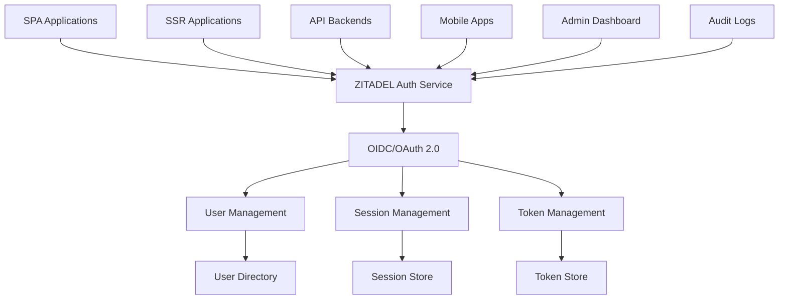

# 🔐 Framework-Agnostic Authentication: ZITADEL Implementation

> Single authentication app serving multiple SSR API backends and single-page applications using ZITADEL

## 📋 Table of Contents

- [Overview](#-overview)
- [ZITADEL Benefits](#-zitadel-benefits)
- [Architecture](#-architecture)
- [Implementation Strategy](#-implementation-strategy)
- [Framework Integration](#-framework-integration)
- [Development Tools](#-development-tools)
- [Security Features](#-security-features)
- [Best Practices](#-best-practices)

## 🎯 Overview

This document provides a comprehensive guide for implementing framework-agnostic authentication using ZITADEL as a centralized authentication service that can serve multiple applications, including SSR API backends and single-page applications.

### Why Framework-Agnostic Authentication?

- **🔄 Universal Compatibility**: Works with any framework (React, Vue, Angular, Svelte, etc.)
- **🏗️ Single Source of Truth**: One authentication service for all applications
- **🔐 Enterprise Security**: ZITADEL provides enterprise-grade security features
- **💰 Cost Effective**: ZITADEL is almost free for authentication purposes
- **⚡ High Performance**: Optimized for both SSR and SPA applications
- **🛠️ Developer Friendly**: Excellent SDKs and documentation

### Key Benefits of ZITADEL

Based on the [Auth.js documentation](https://authjs.dev/) and [ZITADEL's capabilities](https://zitadel.com/docs), ZITADEL offers:

- **✅ OIDC/OAuth 2.0 Compliant**: Industry-standard authentication protocols
- **✅ Multi-Tenant**: Support for multiple organizations and projects
- **✅ SSO Integration**: Single sign-on across all applications
- **✅ MFA Support**: Multi-factor authentication
- **✅ Audit Logging**: Comprehensive security audit trails
- **✅ API Access**: RESTful APIs for custom integrations
- **✅ Webhook Support**: Real-time event notifications
- **✅ Self-Hosted Option**: Complete control over your authentication infrastructure

## 🏗️ Architecture

### High-Level Architecture



### Detailed Component Architecture

```typescript
interface ZitadelAuthArchitecture {
  // Core Authentication Service
  authService: {
    provider: 'zitadel';
    protocols: ['oidc', 'oauth2', 'saml'];
    endpoints: {
      authorization: string;
      token: string;
      userinfo: string;
      logout: string;
    };
  };
  
  // Application Types
  applications: {
    spa: {
      frameworks: ['react', 'vue', 'angular', 'svelte'];
      authFlow: 'authorization-code-pkce';
      tokenStorage: 'memory' | 'localStorage' | 'sessionStorage';
    };
    
    ssr: {
      frameworks: ['nextjs', 'nuxt', 'sveltekit'];
      authFlow: 'authorization-code';
      tokenStorage: 'httpOnly-cookies';
    };
    
    api: {
      frameworks: ['express', 'fastify', 'koa', 'hapi'];
      authFlow: 'client-credentials' | 'jwt-bearer';
      tokenValidation: 'introspection' | 'jwt-verification';
    };
  };
  
  // Security Features
  security: {
    mfa: boolean;
    deviceTrust: boolean;
    sessionManagement: boolean;
    auditLogging: boolean;
    rateLimiting: boolean;
  };
}
```

## 🚀 Implementation Strategy

### Phase 1: ZITADEL Setup

```typescript
// packages/auth-provider/src/zitadel-config.ts
export interface ZitadelConfig {
  issuer: string;
  clientId: string;
  clientSecret: string;
  redirectUri: string;
  scopes: string[];
  responseType: 'code' | 'token' | 'id_token';
  responseMode: 'query' | 'fragment' | 'form_post';
}

export const defaultZitadelConfig: ZitadelConfig = {
  issuer: process.env.ZITADEL_ISSUER!,
  clientId: process.env.ZITADEL_CLIENT_ID!,
  clientSecret: process.env.ZITADEL_CLIENT_SECRET!,
  redirectUri: process.env.ZITADEL_REDIRECT_URI!,
  scopes: [
    'openid',
    'profile',
    'email',
    'offline_access'
  ],
  responseType: 'code',
  responseMode: 'query',
};
```

### Phase 2: Framework-Agnostic Core

```typescript
// packages/auth-provider/src/core.ts
export class ZitadelAuthProvider {
  private config: ZitadelConfig;
  private tokenManager: TokenManager;
  private sessionManager: SessionManager;
  
  constructor(config: ZitadelConfig) {
    this.config = config;
    this.tokenManager = new TokenManager();
    this.sessionManager = new SessionManager();
  }
  
  // Universal authentication method
  async authenticate(flow: 'spa' | 'ssr' | 'api'): Promise<AuthResult> {
    switch (flow) {
      case 'spa':
        return await this.authenticateSPA();
      case 'ssr':
        return await this.authenticateSSR();
      case 'api':
        return await this.authenticateAPI();
      default:
        throw new Error(`Unsupported authentication flow: ${flow}`);
    }
  }
  
  // SPA Authentication (Authorization Code + PKCE)
  private async authenticateSPA(): Promise<AuthResult> {
    const codeVerifier = this.generateCodeVerifier();
    const codeChallenge = await this.generateCodeChallenge(codeVerifier);
    
    const authUrl = this.buildAuthorizationUrl({
      responseType: 'code',
      codeChallenge,
      codeChallengeMethod: 'S256',
    });
    
    // Redirect to ZITADEL
    window.location.href = authUrl;
    
    // Handle callback
    return await this.handleCallback(codeVerifier);
  }
  
  // SSR Authentication (Authorization Code)
  private async authenticateSSR(): Promise<AuthResult> {
    const state = this.generateState();
    
    const authUrl = this.buildAuthorizationUrl({
      responseType: 'code',
      state,
    });
    
    // Store state in session
    this.sessionManager.setState(state);
    
    // Redirect to ZITADEL
    return { redirectUrl: authUrl };
  }
  
  // API Authentication (Client Credentials)
  private async authenticateAPI(): Promise<AuthResult> {
    const tokenResponse = await this.requestToken({
      grantType: 'client_credentials',
      clientId: this.config.clientId,
      clientSecret: this.config.clientSecret,
    });
    
    return {
      accessToken: tokenResponse.access_token,
      tokenType: tokenResponse.token_type,
      expiresIn: tokenResponse.expires_in,
    };
  }
  
  // Token validation for all flows
  async validateToken(token: string): Promise<ValidationResult> {
    try {
      const response = await fetch(`${this.config.issuer}/oauth/v2/introspect`, {
        method: 'POST',
        headers: {
          'Content-Type': 'application/x-www-form-urlencoded',
          'Authorization': `Bearer ${token}`,
        },
        body: new URLSearchParams({
          token,
          client_id: this.config.clientId,
          client_secret: this.config.clientSecret,
        }),
      });
      
      const result = await response.json();
      return {
        valid: result.active,
        user: result.sub,
        scopes: result.scope?.split(' ') || [],
        expiresAt: result.exp,
      };
    } catch (error) {
      console.error('Token validation failed:', error);
      return { valid: false };
    }
  }
  
  // Logout for all flows
  async logout(flow: 'spa' | 'ssr' | 'api'): Promise<void> {
    const logoutUrl = `${this.config.issuer}/oidc/v1/end_session`;
    
    switch (flow) {
      case 'spa':
        // Clear local storage and redirect
        this.tokenManager.clearTokens();
        window.location.href = logoutUrl;
        break;
      case 'ssr':
        // Clear session and redirect
        this.sessionManager.clearSession();
        return { redirectUrl: logoutUrl };
      case 'api':
        // Revoke token
        await this.revokeToken();
        break;
    }
  }
}
```

### Phase 3: Framework-Specific Adapters

```typescript
// packages/auth-provider/src/adapters/react.ts
import { ZitadelAuthProvider } from '../core';

export class ReactAuthAdapter {
  private authProvider: ZitadelAuthProvider;
  
  constructor(config: ZitadelConfig) {
    this.authProvider = new ZitadelAuthProvider(config);
  }
  
  // React Hook for authentication
  useAuth() {
    const [user, setUser] = useState(null);
    const [loading, setLoading] = useState(true);
    const [error, setError] = useState(null);
    
    useEffect(() => {
      this.checkAuthStatus();
    }, []);
    
    const login = async () => {
      try {
        setLoading(true);
        const result = await this.authProvider.authenticate('spa');
        setUser(result.user);
      } catch (err) {
        setError(err);
      } finally {
        setLoading(false);
      }
    };
    
    const logout = async () => {
      try {
        await this.authProvider.logout('spa');
        setUser(null);
      } catch (err) {
        setError(err);
      }
    };
    
    return { user, loading, error, login, logout };
  }
  
  // Protected route component
  ProtectedRoute({ children }: { children: React.ReactNode }) {
    const { user, loading } = useAuth();
    
    if (loading) {
      return <div>Loading...</div>;
    }
    
    if (!user) {
      return <div>Please log in</div>;
    }
    
    return <>{children}</>;
  }
}

// packages/auth-provider/src/adapters/nextjs.ts
export class NextJSAuthAdapter {
  private authProvider: ZitadelAuthProvider;
  
  constructor(config: ZitadelConfig) {
    this.authProvider = new ZitadelAuthProvider(config);
  }
  
  // Next.js middleware for authentication
  middleware(request: NextRequest) {
    const token = request.cookies.get('auth-token')?.value;
    
    if (!token) {
      return NextResponse.redirect(new URL('/auth/login', request.url));
    }
    
    // Validate token
    const isValid = await this.authProvider.validateToken(token);
    
    if (!isValid.valid) {
      return NextResponse.redirect(new URL('/auth/login', request.url));
    }
    
    return NextResponse.next();
  }
  
  // API route handler for authentication
  async handler(request: NextRequest) {
    const { searchParams } = new URL(request.url);
    const code = searchParams.get('code');
    const state = searchParams.get('state');
    
    if (code && state) {
      const result = await this.authProvider.handleCallback(code, state);
      
      const response = NextResponse.redirect(new URL('/dashboard', request.url));
      response.cookies.set('auth-token', result.accessToken, {
        httpOnly: true,
        secure: process.env.NODE_ENV === 'production',
        sameSite: 'lax',
        maxAge: result.expiresIn,
      });
      
      return response;
    }
    
    return NextResponse.redirect(new URL('/auth/login', request.url));
  }
}

// packages/auth-provider/src/adapters/express.ts
export class ExpressAuthAdapter {
  private authProvider: ZitadelAuthProvider;
  
  constructor(config: ZitadelConfig) {
    this.authProvider = new ZitadelAuthProvider(config);
  }
  
  // Express middleware for authentication
  authenticate() {
    return async (req: Request, res: Response, next: NextFunction) => {
      const token = req.headers.authorization?.replace('Bearer ', '');
      
      if (!token) {
        return res.status(401).json({ error: 'No token provided' });
      }
      
      try {
        const validation = await this.authProvider.validateToken(token);
        
        if (!validation.valid) {
          return res.status(401).json({ error: 'Invalid token' });
        }
        
        req.user = validation.user;
        req.scopes = validation.scopes;
        next();
      } catch (error) {
        return res.status(401).json({ error: 'Authentication failed' });
      }
    };
  }
  
  // Role-based authorization middleware
  requireRole(role: string) {
    return (req: Request, res: Response, next: NextFunction) => {
      if (!req.user) {
        return res.status(401).json({ error: 'User not authenticated' });
      }
      
      if (!req.scopes?.includes(role)) {
        return res.status(403).json({ error: 'Insufficient permissions' });
      }
      
      next();
    };
  }
}
```

## 🔧 Framework Integration

### React SPA Integration

```typescript
// apps/admin/src/auth/zitadel-auth.tsx
import { ZitadelAuthProvider } from '@repo/auth-provider';

const zitadelConfig = {
  issuer: process.env.VITE_ZITADEL_ISSUER!,
  clientId: process.env.VITE_ZITADEL_CLIENT_ID!,
  redirectUri: `${window.location.origin}/auth/callback`,
  scopes: ['openid', 'profile', 'email'],
};

const authProvider = new ZitadelAuthProvider(zitadelConfig);

export function useZitadelAuth() {
  const [user, setUser] = useState(null);
  const [loading, setLoading] = useState(true);
  
  useEffect(() => {
    // Check if user is already authenticated
    const token = localStorage.getItem('access_token');
    if (token) {
      authProvider.validateToken(token).then(validation => {
        if (validation.valid) {
          setUser(validation.user);
        } else {
          localStorage.removeItem('access_token');
        }
        setLoading(false);
      });
    } else {
      setLoading(false);
    }
  }, []);
  
  const login = async () => {
    await authProvider.authenticate('spa');
  };
  
  const logout = async () => {
    await authProvider.logout('spa');
    setUser(null);
  };
  
  return { user, loading, login, logout };
}

// Usage in components
export function LoginButton() {
  const { login } = useZitadelAuth();
  
  return (
    <button onClick={login}>
      Login with ZITADEL
    </button>
  );
}

export function ProtectedComponent() {
  const { user, loading } = useZitadelAuth();
  
  if (loading) return <div>Loading...</div>;
  if (!user) return <div>Please log in</div>;
  
  return <div>Welcome, {user.name}!</div>;
}
```

### Next.js SSR Integration

```typescript
// apps/storefront/src/auth/zitadel-auth.tsx
import { ZitadelAuthProvider } from '@repo/auth-provider';

const zitadelConfig = {
  issuer: process.env.ZITADEL_ISSUER!,
  clientId: process.env.ZITADEL_CLIENT_ID!,
  clientSecret: process.env.ZITADEL_CLIENT_SECRET!,
  redirectUri: `${process.env.NEXT_PUBLIC_BASE_URL}/auth/callback`,
  scopes: ['openid', 'profile', 'email'],
};

const authProvider = new ZitadelAuthProvider(zitadelConfig);

// Middleware for authentication
export function middleware(request: NextRequest) {
  const token = request.cookies.get('auth-token')?.value;
  
  if (!token) {
    return NextResponse.redirect(new URL('/auth/login', request.url));
  }
  
  // Validate token with ZITADEL
  const isValid = await authProvider.validateToken(token);
  
  if (!isValid.valid) {
    const response = NextResponse.redirect(new URL('/auth/login', request.url));
    response.cookies.delete('auth-token');
    return response;
  }
  
  return NextResponse.next();
}

// API route for authentication callback
export async function GET(request: NextRequest) {
  const { searchParams } = new URL(request.url);
  const code = searchParams.get('code');
  const state = searchParams.get('state');
  
  if (code && state) {
    try {
      const result = await authProvider.handleCallback(code, state);
      
      const response = NextResponse.redirect(new URL('/dashboard', request.url));
      response.cookies.set('auth-token', result.accessToken, {
        httpOnly: true,
        secure: process.env.NODE_ENV === 'production',
        sameSite: 'lax',
        maxAge: result.expiresIn,
      });
      
      return response;
    } catch (error) {
      return NextResponse.redirect(new URL('/auth/error', request.url));
    }
  }
  
  return NextResponse.redirect(new URL('/auth/login', request.url));
}

// Server-side authentication hook
export function useServerAuth(request: NextRequest) {
  const token = request.cookies.get('auth-token')?.value;
  
  if (!token) {
    return { user: null, isAuthenticated: false };
  }
  
  const validation = await authProvider.validateToken(token);
  
  return {
    user: validation.user,
    isAuthenticated: validation.valid,
  };
}
```

### Express API Integration

```typescript
// apps/api/src/auth/zitadel-auth.ts
import { ZitadelAuthProvider } from '@repo/auth-provider';
import { Request, Response, NextFunction } from 'express';

const zitadelConfig = {
  issuer: process.env.ZITADEL_ISSUER!,
  clientId: process.env.ZITADEL_CLIENT_ID!,
  clientSecret: process.env.ZITADEL_CLIENT_SECRET!,
  scopes: ['openid', 'profile', 'email'],
};

const authProvider = new ZitadelAuthProvider(zitadelConfig);

// Authentication middleware
export const authenticate = async (req: Request, res: Response, next: NextFunction) => {
  const token = req.headers.authorization?.replace('Bearer ', '');
  
  if (!token) {
    return res.status(401).json({ error: 'No token provided' });
  }
  
  try {
    const validation = await authProvider.validateToken(token);
    
    if (!validation.valid) {
      return res.status(401).json({ error: 'Invalid token' });
    }
    
    req.user = validation.user;
    req.scopes = validation.scopes;
    next();
  } catch (error) {
    return res.status(401).json({ error: 'Authentication failed' });
  }
};

// Role-based authorization middleware
export const requireRole = (role: string) => {
  return (req: Request, res: Response, next: NextFunction) => {
    if (!req.user) {
      return res.status(401).json({ error: 'User not authenticated' });
    }
    
    if (!req.scopes?.includes(role)) {
      return res.status(403).json({ error: 'Insufficient permissions' });
    }
    
    next();
  };
};

// API routes
app.get('/api/protected', authenticate, (req, res) => {
  res.json({ message: 'Protected data', user: req.user });
});

app.get('/api/admin', authenticate, requireRole('admin'), (req, res) => {
  res.json({ message: 'Admin data', user: req.user });
});
```

## 🛠️ Development Tools

### CLI Tools for Authentication Management

```typescript
// packages/auth-cli/src/cli.ts
import { Command } from 'commander';
import { ZitadelAuthProvider } from '@repo/auth-provider';

const program = new Command();
const authProvider = new ZitadelAuthProvider({
  issuer: process.env.ZITADEL_ISSUER!,
  clientId: process.env.ZITADEL_CLIENT_ID!,
  clientSecret: process.env.ZITADEL_CLIENT_SECRET!,
});

program
  .name('zitadel-auth')
  .description('ZITADEL authentication management')
  .version('1.0.0');

program
  .command('login')
  .description('Login to ZITADEL')
  .option('-f, --flow <flow>', 'Authentication flow', 'spa')
  .action(async (options) => {
    try {
      const result = await authProvider.authenticate(options.flow);
      console.log('✅ Login successful');
      console.log('User:', result.user);
    } catch (error) {
      console.error('❌ Login failed:', error);
      process.exit(1);
    }
  });

program
  .command('logout')
  .description('Logout from ZITADEL')
  .option('-f, --flow <flow>', 'Authentication flow', 'spa')
  .action(async (options) => {
    try {
      await authProvider.logout(options.flow);
      console.log('✅ Logout successful');
    } catch (error) {
      console.error('❌ Logout failed:', error);
      process.exit(1);
    }
  });

program
  .command('validate <token>')
  .description('Validate authentication token')
  .action(async (token) => {
    try {
      const result = await authProvider.validateToken(token);
      console.log('Token validation result:', result);
    } catch (error) {
      console.error('❌ Token validation failed:', error);
      process.exit(1);
    }
  });

program
  .command('userinfo')
  .description('Get current user information')
  .action(async () => {
    try {
      const user = await authProvider.getUserInfo();
      console.log('User information:', user);
    } catch (error) {
      console.error('❌ Failed to get user info:', error);
      process.exit(1);
    }
  });

program.parse();
```

### VS Code Extension

```typescript
// packages/vscode-auth-extension/src/extension.ts
import * as vscode from 'vscode';
import { ZitadelAuthProvider } from '@repo/auth-provider';

export class AuthExtension {
  private authProvider: ZitadelAuthProvider;
  
  constructor() {
    this.authProvider = new ZitadelAuthProvider({
      issuer: process.env.ZITADEL_ISSUER!,
      clientId: process.env.ZITADEL_CLIENT_ID!,
      clientSecret: process.env.ZITADEL_CLIENT_SECRET!,
    });
  }
  
  activate(context: vscode.ExtensionContext) {
    // Register commands
    context.subscriptions.push(
      vscode.commands.registerCommand('zitadel-auth.login', this.login.bind(this)),
      vscode.commands.registerCommand('zitadel-auth.logout', this.logout.bind(this)),
      vscode.commands.registerCommand('zitadel-auth.userinfo', this.userinfo.bind(this)),
    );
    
    // Register status bar
    this.registerStatusBarItem();
  }
  
  private async login(): Promise<void> {
    try {
      const result = await this.authProvider.authenticate('spa');
      vscode.window.showInformationMessage(`✅ Logged in as ${result.user.name}`);
    } catch (error) {
      vscode.window.showErrorMessage(`❌ Login failed: ${error}`);
    }
  }
  
  private async logout(): Promise<void> {
    try {
      await this.authProvider.logout('spa');
      vscode.window.showInformationMessage('✅ Logged out successfully');
    } catch (error) {
      vscode.window.showErrorMessage(`❌ Logout failed: ${error}`);
    }
  }
  
  private async userinfo(): Promise<void> {
    try {
      const user = await this.authProvider.getUserInfo();
      vscode.window.showInformationMessage(`User: ${user.name} (${user.email})`);
    } catch (error) {
      vscode.window.showErrorMessage(`❌ Failed to get user info: ${error}`);
    }
  }
  
  private registerStatusBarItem(): void {
    const statusBarItem = vscode.window.createStatusBarItem(vscode.StatusBarAlignment.Left);
    statusBarItem.text = '$(person) ZITADEL: Not logged in';
    statusBarItem.command = 'zitadel-auth.login';
    statusBarItem.show();
  }
}
```

## 🔒 Security Features

### Multi-Factor Authentication

```typescript
// packages/auth-provider/src/mfa.ts
export class MFAManager {
  async setupMFA(userId: string): Promise<MFASetup> {
    const response = await fetch(`${this.config.issuer}/oidc/v1/users/${userId}/mfa`, {
      method: 'POST',
      headers: {
        'Authorization': `Bearer ${this.accessToken}`,
        'Content-Type': 'application/json',
      },
      body: JSON.stringify({
        type: 'totp',
      }),
    });
    
    const result = await response.json();
    return {
      qrCode: result.qrCode,
      secret: result.secret,
      backupCodes: result.backupCodes,
    };
  }
  
  async verifyMFA(userId: string, code: string): Promise<boolean> {
    const response = await fetch(`${this.config.issuer}/oidc/v1/users/${userId}/mfa/verify`, {
      method: 'POST',
      headers: {
        'Authorization': `Bearer ${this.accessToken}`,
        'Content-Type': 'application/json',
      },
      body: JSON.stringify({
        code,
      }),
    });
    
    return response.ok;
  }
}
```

### Session Management

```typescript
// packages/auth-provider/src/session.ts
export class SessionManager {
  async createSession(userId: string, deviceInfo: DeviceInfo): Promise<Session> {
    const response = await fetch(`${this.config.issuer}/oidc/v1/sessions`, {
      method: 'POST',
      headers: {
        'Authorization': `Bearer ${this.accessToken}`,
        'Content-Type': 'application/json',
      },
      body: JSON.stringify({
        userId,
        deviceInfo,
        expiresIn: 3600, // 1 hour
      }),
    });
    
    return await response.json();
  }
  
  async listSessions(userId: string): Promise<Session[]> {
    const response = await fetch(`${this.config.issuer}/oidc/v1/users/${userId}/sessions`, {
      headers: {
        'Authorization': `Bearer ${this.accessToken}`,
      },
    });
    
    return await response.json();
  }
  
  async revokeSession(sessionId: string): Promise<void> {
    await fetch(`${this.config.issuer}/oidc/v1/sessions/${sessionId}`, {
      method: 'DELETE',
      headers: {
        'Authorization': `Bearer ${this.accessToken}`,
      },
    });
  }
}
```

### Audit Logging

```typescript
// packages/auth-provider/src/audit.ts
export class AuditLogger {
  async logEvent(event: AuditEvent): Promise<void> {
    await fetch(`${this.config.issuer}/audit/v1/events`, {
      method: 'POST',
      headers: {
        'Authorization': `Bearer ${this.accessToken}`,
        'Content-Type': 'application/json',
      },
      body: JSON.stringify(event),
    });
  }
  
  async getAuditLogs(filters: AuditFilters): Promise<AuditEvent[]> {
    const params = new URLSearchParams();
    if (filters.userId) params.append('userId', filters.userId);
    if (filters.eventType) params.append('eventType', filters.eventType);
    if (filters.startDate) params.append('startDate', filters.startDate);
    if (filters.endDate) params.append('endDate', filters.endDate);
    
    const response = await fetch(`${this.config.issuer}/audit/v1/events?${params}`, {
      headers: {
        'Authorization': `Bearer ${this.accessToken}`,
      },
    });
    
    return await response.json();
  }
}
```

## 📋 Best Practices

### 1. Security Best Practices

```typescript
const securityBestPractices = {
  // Token management
  tokenManagement: {
    useHttpOnlyCookies: true,        // For SSR applications
    useSecureStorage: true,          // For SPA applications
    implementTokenRefresh: true,     // Automatic token refresh
    validateTokens: true,            // Regular token validation
  };
  
  // Session management
  sessionManagement: {
    implementSessionTimeout: true,    // Automatic session expiration
    trackActiveSessions: true,       // Monitor active sessions
    allowSessionRevocation: true,    // Users can revoke sessions
    implementDeviceTrust: true,      // Trusted device management
  };
  
  // Multi-factor authentication
  mfa: {
    requireMFA: true,                // Require MFA for sensitive operations
    supportTOTP: true,               // Time-based one-time passwords
    supportSMS: true,                // SMS-based authentication
    supportBackupCodes: true,        // Backup codes for account recovery
  };
  
  // Audit and compliance
  audit: {
    logAllEvents: true,              // Comprehensive event logging
    implementAuditTrail: true,       // Complete audit trail
    enableRealTimeAlerts: true,      // Real-time security alerts
    complyWithStandards: true,       // GDPR, SOX, HIPAA compliance
  };
};
```

### 2. Framework Integration Best Practices

```typescript
const frameworkIntegrationBestPractices = {
  // React SPA
  react: {
    useHooks: true,                  // Custom hooks for authentication
    implementContext: true,           // React context for auth state
    useProtectedRoutes: true,         // Route protection
    implementLazyLoading: true,       // Lazy load auth components
  };
  
  // Next.js SSR
  nextjs: {
    useMiddleware: true,              // Authentication middleware
    implementServerSideAuth: true,    // Server-side authentication
    useHttpOnlyCookies: true,        // Secure cookie storage
    implementAPIProtection: true,     // API route protection
  };
  
  // Express API
  express: {
    useMiddleware: true,              // Authentication middleware
    implementRoleBasedAuth: true,     // Role-based authorization
    validateTokens: true,             // Token validation
    implementRateLimiting: true,      // Rate limiting
  };
  
  // Universal patterns
  universal: {
    handleErrors: true,               // Comprehensive error handling
    implementRetryLogic: true,        // Retry failed requests
    useTypeScript: true,              // Type safety
    implementTesting: true,           // Comprehensive testing
  };
};
```

### 3. Performance Best Practices

```typescript
const performanceBestPractices = {
  // Caching
  caching: {
    cacheUserInfo: true,              // Cache user information
    cacheTokenValidation: true,       // Cache token validation results
    implementCacheInvalidation: true, // Proper cache invalidation
    useRedis: true,                   // Use Redis for distributed caching
  };
  
  // Optimization
  optimization: {
    lazyLoadAuth: true,               // Lazy load authentication
    implementTokenRefresh: true,      // Background token refresh
    useCDN: true,                     // Use CDN for static assets
    optimizeBundleSize: true,         // Minimize bundle size
  };
  
  // Monitoring
  monitoring: {
    trackAuthMetrics: true,           // Track authentication metrics
    implementHealthChecks: true,      // Health checks for auth service
    useAPM: true,                     // Application performance monitoring
    implementAlerting: true,          // Real-time alerting
  };
};
```

## 🔗 Related Documentation

- [Environment Variables Management](./9_ENVIRONMENT_VARIABLES.md) - Core environment variable system
- [Enterprise Developer Experience](./10_ENTERPRISE_ENV_DEVELOPER_EXPERIENCE.md) - Developer experience design
- [Enterprise Implementation](./11_ENTERPRISE_ENV_IMPLEMENTATION.md) - Vercel-based implementation
- [HashiCorp Vault Implementation](./13_HASHICORP_VAULT_ZITADEL_IMPLEMENTATION.md) - Enterprise Vault + ZITADEL
- [Hobby Project Solutions](./14_HOBBY_PROJECT_ENV_SOLUTIONS.md) - Simple solutions for small projects

---

**Framework-Agnostic Authentication**: This guide provides a comprehensive implementation for framework-agnostic authentication using ZITADEL as a centralized authentication service, supporting multiple SSR API backends and single-page applications with enterprise-grade security features. 


<svg aria-roledescription="flowchart-v2" role="graphics-document document" viewBox="-8 -8 635.6353759765625 301" style="max-width: 635.6353759765625px;" xmlns="http://www.w3.org/2000/svg" width="100%" id="mermaid-svg-1753339923343-tc7gxg4d1"><style>#mermaid-svg-1753339923343-tc7gxg4d1{font-family:"trebuchet ms",verdana,arial,sans-serif;font-size:16px;fill:rgba(204, 204, 204, 0.87);}#mermaid-svg-1753339923343-tc7gxg4d1 .error-icon{fill:#bf616a;}#mermaid-svg-1753339923343-tc7gxg4d1 .error-text{fill:#bf616a;stroke:#bf616a;}#mermaid-svg-1753339923343-tc7gxg4d1 .edge-thickness-normal{stroke-width:2px;}#mermaid-svg-1753339923343-tc7gxg4d1 .edge-thickness-thick{stroke-width:3.5px;}#mermaid-svg-1753339923343-tc7gxg4d1 .edge-pattern-solid{stroke-dasharray:0;}#mermaid-svg-1753339923343-tc7gxg4d1 .edge-pattern-dashed{stroke-dasharray:3;}#mermaid-svg-1753339923343-tc7gxg4d1 .edge-pattern-dotted{stroke-dasharray:2;}#mermaid-svg-1753339923343-tc7gxg4d1 .marker{fill:rgba(204, 204, 204, 0.87);stroke:rgba(204, 204, 204, 0.87);}#mermaid-svg-1753339923343-tc7gxg4d1 .marker.cross{stroke:rgba(204, 204, 204, 0.87);}#mermaid-svg-1753339923343-tc7gxg4d1 svg{font-family:"trebuchet ms",verdana,arial,sans-serif;font-size:16px;}#mermaid-svg-1753339923343-tc7gxg4d1 .label{font-family:"trebuchet ms",verdana,arial,sans-serif;color:rgba(204, 204, 204, 0.87);}#mermaid-svg-1753339923343-tc7gxg4d1 .cluster-label text{fill:#ffffff;}#mermaid-svg-1753339923343-tc7gxg4d1 .cluster-label span,#mermaid-svg-1753339923343-tc7gxg4d1 p{color:#ffffff;}#mermaid-svg-1753339923343-tc7gxg4d1 .label text,#mermaid-svg-1753339923343-tc7gxg4d1 span,#mermaid-svg-1753339923343-tc7gxg4d1 p{fill:rgba(204, 204, 204, 0.87);color:rgba(204, 204, 204, 0.87);}#mermaid-svg-1753339923343-tc7gxg4d1 .node rect,#mermaid-svg-1753339923343-tc7gxg4d1 .node circle,#mermaid-svg-1753339923343-tc7gxg4d1 .node ellipse,#mermaid-svg-1753339923343-tc7gxg4d1 .node polygon,#mermaid-svg-1753339923343-tc7gxg4d1 .node path{fill:#1a1a1a;stroke:#2a2a2a;stroke-width:1px;}#mermaid-svg-1753339923343-tc7gxg4d1 .flowchart-label text{text-anchor:middle;}#mermaid-svg-1753339923343-tc7gxg4d1 .node .label{text-align:center;}#mermaid-svg-1753339923343-tc7gxg4d1 .node.clickable{cursor:pointer;}#mermaid-svg-1753339923343-tc7gxg4d1 .arrowheadPath{fill:#e5e5e5;}#mermaid-svg-1753339923343-tc7gxg4d1 .edgePath .path{stroke:rgba(204, 204, 204, 0.87);stroke-width:2.0px;}#mermaid-svg-1753339923343-tc7gxg4d1 .flowchart-link{stroke:rgba(204, 204, 204, 0.87);fill:none;}#mermaid-svg-1753339923343-tc7gxg4d1 .edgeLabel{background-color:#1a1a1a99;text-align:center;}#mermaid-svg-1753339923343-tc7gxg4d1 .edgeLabel rect{opacity:0.5;background-color:#1a1a1a99;fill:#1a1a1a99;}#mermaid-svg-1753339923343-tc7gxg4d1 .labelBkg{background-color:rgba(26, 26, 26, 0.5);}#mermaid-svg-1753339923343-tc7gxg4d1 .cluster rect{fill:rgba(64, 64, 64, 0.47);stroke:#30373a;stroke-width:1px;}#mermaid-svg-1753339923343-tc7gxg4d1 .cluster text{fill:#ffffff;}#mermaid-svg-1753339923343-tc7gxg4d1 .cluster span,#mermaid-svg-1753339923343-tc7gxg4d1 p{color:#ffffff;}#mermaid-svg-1753339923343-tc7gxg4d1 div.mermaidTooltip{position:absolute;text-align:center;max-width:200px;padding:2px;font-family:"trebuchet ms",verdana,arial,sans-serif;font-size:12px;background:#88c0d0;border:1px solid #30373a;border-radius:2px;pointer-events:none;z-index:100;}#mermaid-svg-1753339923343-tc7gxg4d1 .flowchartTitleText{text-anchor:middle;font-size:18px;fill:rgba(204, 204, 204, 0.87);}#mermaid-svg-1753339923343-tc7gxg4d1 :root{--mermaid-font-family:"trebuchet ms",verdana,arial,sans-serif;}</style><g><marker orient="auto" markerHeight="12" markerWidth="12" markerUnits="userSpaceOnUse" refY="5" refX="6" viewBox="0 0 10 10" class="marker flowchart" id="mermaid-svg-1753339923343-tc7gxg4d1_flowchart-pointEnd"><path style="stroke-width: 1; stroke-dasharray: 1, 0;" class="arrowMarkerPath" d="M 0 0 L 10 5 L 0 10 z"/></marker><marker orient="auto" markerHeight="12" markerWidth="12" markerUnits="userSpaceOnUse" refY="5" refX="4.5" viewBox="0 0 10 10" class="marker flowchart" id="mermaid-svg-1753339923343-tc7gxg4d1_flowchart-pointStart"><path style="stroke-width: 1; stroke-dasharray: 1, 0;" class="arrowMarkerPath" d="M 0 5 L 10 10 L 10 0 z"/></marker><marker orient="auto" markerHeight="11" markerWidth="11" markerUnits="userSpaceOnUse" refY="5" refX="11" viewBox="0 0 10 10" class="marker flowchart" id="mermaid-svg-1753339923343-tc7gxg4d1_flowchart-circleEnd"><circle style="stroke-width: 1; stroke-dasharray: 1, 0;" class="arrowMarkerPath" r="5" cy="5" cx="5"/></marker><marker orient="auto" markerHeight="11" markerWidth="11" markerUnits="userSpaceOnUse" refY="5" refX="-1" viewBox="0 0 10 10" class="marker flowchart" id="mermaid-svg-1753339923343-tc7gxg4d1_flowchart-circleStart"><circle style="stroke-width: 1; stroke-dasharray: 1, 0;" class="arrowMarkerPath" r="5" cy="5" cx="5"/></marker><marker orient="auto" markerHeight="11" markerWidth="11" markerUnits="userSpaceOnUse" refY="5.2" refX="12" viewBox="0 0 11 11" class="marker cross flowchart" id="mermaid-svg-1753339923343-tc7gxg4d1_flowchart-crossEnd"><path style="stroke-width: 2; stroke-dasharray: 1, 0;" class="arrowMarkerPath" d="M 1,1 l 9,9 M 10,1 l -9,9"/></marker><marker orient="auto" markerHeight="11" markerWidth="11" markerUnits="userSpaceOnUse" refY="5.2" refX="-1" viewBox="0 0 11 11" class="marker cross flowchart" id="mermaid-svg-1753339923343-tc7gxg4d1_flowchart-crossStart"><path style="stroke-width: 2; stroke-dasharray: 1, 0;" class="arrowMarkerPath" d="M 1,1 l 9,9 M 10,1 l -9,9"/></marker><g class="root"><g class="clusters"/><g class="edgePaths"><path marker-end="url(#mermaid-svg-1753339923343-tc7gxg4d1_flowchart-pointEnd)" style="fill:none;" class="edge-thickness-normal edge-pattern-solid flowchart-link LS-A LE-B" id="L-A-B-0" d="M64.958,33.75L64.958,37.917C64.958,42.083,64.958,50.417,92.008,59.113C119.058,67.81,173.159,76.87,200.209,81.401L227.26,85.931"/><path marker-end="url(#mermaid-svg-1753339923343-tc7gxg4d1_flowchart-pointEnd)" style="fill:none;" class="edge-thickness-normal edge-pattern-solid flowchart-link LS-C LE-B" id="L-C-B-0" d="M245.531,33.75L245.531,37.917C245.531,42.083,245.531,50.417,251.687,58.294C257.843,66.171,270.155,73.593,276.311,77.303L282.468,81.014"/><path marker-end="url(#mermaid-svg-1753339923343-tc7gxg4d1_flowchart-pointEnd)" style="fill:none;" class="edge-thickness-normal edge-pattern-solid flowchart-link LS-D LE-B" id="L-D-B-0" d="M415.618,33.75L415.618,37.917C415.618,42.083,415.618,50.417,406.423,58.411C397.227,66.405,378.835,74.059,369.639,77.886L360.443,81.714"/><path marker-end="url(#mermaid-svg-1753339923343-tc7gxg4d1_flowchart-pointEnd)" style="fill:none;" class="edge-thickness-normal edge-pattern-solid flowchart-link LS-E LE-B" id="L-E-B-0" d="M569.863,33.75L569.863,37.917C569.863,42.083,569.863,50.417,542.011,59.16C514.159,67.903,458.454,77.055,430.602,81.631L402.749,86.208"/><path marker-end="url(#mermaid-svg-1753339923343-tc7gxg4d1_flowchart-pointEnd)" style="fill:none;" class="edge-thickness-normal edge-pattern-solid flowchart-link LS-B LE-F" id="L-B-F-0" d="M315.003,117.5L315.003,121.667C315.003,125.833,315.003,134.167,315.003,141.617C315.003,149.067,315.003,155.633,315.003,158.917L315.003,162.2"/><path marker-end="url(#mermaid-svg-1753339923343-tc7gxg4d1_flowchart-pointEnd)" style="fill:none;" class="edge-thickness-normal edge-pattern-solid flowchart-link LS-F LE-G" id="L-F-G-0" d="M250.238,197.794L227.346,202.536C204.455,207.279,158.673,216.765,135.782,224.791C112.891,232.817,112.891,239.383,112.891,242.667L112.891,245.95"/><path marker-end="url(#mermaid-svg-1753339923343-tc7gxg4d1_flowchart-pointEnd)" style="fill:none;" class="edge-thickness-normal edge-pattern-solid flowchart-link LS-F LE-H" id="L-F-H-0" d="M315.003,201.25L315.003,205.417C315.003,209.583,315.003,217.917,315.003,225.367C315.003,232.817,315.003,239.383,315.003,242.667L315.003,245.95"/><path marker-end="url(#mermaid-svg-1753339923343-tc7gxg4d1_flowchart-pointEnd)" style="fill:none;" class="edge-thickness-normal edge-pattern-solid flowchart-link LS-F LE-I" id="L-F-I-0" d="M379.769,197.481L403.462,202.276C427.156,207.071,474.543,216.66,498.237,224.739C521.93,232.817,521.93,239.383,521.93,242.667L521.93,245.95"/></g><g class="edgeLabels"><g class="edgeLabel"><g transform="translate(0, 0)" class="label"><foreignObject height="0" width="0"><div style="display: inline-block; white-space: nowrap;" xmlns="http://www.w3.org/1999/xhtml"><span class="edgeLabel"></span></div></foreignObject></g></g><g class="edgeLabel"><g transform="translate(0, 0)" class="label"><foreignObject height="0" width="0"><div style="display: inline-block; white-space: nowrap;" xmlns="http://www.w3.org/1999/xhtml"><span class="edgeLabel"></span></div></foreignObject></g></g><g class="edgeLabel"><g transform="translate(0, 0)" class="label"><foreignObject height="0" width="0"><div style="display: inline-block; white-space: nowrap;" xmlns="http://www.w3.org/1999/xhtml"><span class="edgeLabel"></span></div></foreignObject></g></g><g class="edgeLabel"><g transform="translate(0, 0)" class="label"><foreignObject height="0" width="0"><div style="display: inline-block; white-space: nowrap;" xmlns="http://www.w3.org/1999/xhtml"><span class="edgeLabel"></span></div></foreignObject></g></g><g class="edgeLabel"><g transform="translate(0, 0)" class="label"><foreignObject height="0" width="0"><div style="display: inline-block; white-space: nowrap;" xmlns="http://www.w3.org/1999/xhtml"><span class="edgeLabel"></span></div></foreignObject></g></g><g class="edgeLabel"><g transform="translate(0, 0)" class="label"><foreignObject height="0" width="0"><div style="display: inline-block; white-space: nowrap;" xmlns="http://www.w3.org/1999/xhtml"><span class="edgeLabel"></span></div></foreignObject></g></g><g class="edgeLabel"><g transform="translate(0, 0)" class="label"><foreignObject height="0" width="0"><div style="display: inline-block; white-space: nowrap;" xmlns="http://www.w3.org/1999/xhtml"><span class="edgeLabel"></span></div></foreignObject></g></g><g class="edgeLabel"><g transform="translate(0, 0)" class="label"><foreignObject height="0" width="0"><div style="display: inline-block; white-space: nowrap;" xmlns="http://www.w3.org/1999/xhtml"><span class="edgeLabel"></span></div></foreignObject></g></g></g><g class="nodes"><g transform="translate(64.95767974853516, 16.875)" id="flowchart-A-16" class="node default default flowchart-label"><rect height="33.75" width="129.9153594970703" y="-16.875" x="-64.95767974853516" ry="0" rx="0" style="" class="basic label-container"/><g transform="translate(-57.457679748535156, -9.375)" style="" class="label"><rect/><foreignObject height="18.75" width="114.91535949707031"><div style="display: inline-block; white-space: nowrap;" xmlns="http://www.w3.org/1999/xhtml"><span class="nodeLabel">SPA Applications</span></div></foreignObject></g></g><g transform="translate(315.0032539367676, 100.625)" id="flowchart-B-17" class="node default default flowchart-label"><rect height="33.75" width="165.0325469970703" y="-16.875" x="-82.51627349853516" ry="0" rx="0" style="" class="basic label-container"/><g transform="translate(-75.01627349853516, -9.375)" style="" class="label"><rect/><foreignObject height="18.75" width="150.0325469970703"><div style="display: inline-block; white-space: nowrap;" xmlns="http://www.w3.org/1999/xhtml"><span class="nodeLabel">ZITADEL Auth Service</span></div></foreignObject></g></g><g transform="translate(245.5305938720703, 16.875)" id="flowchart-C-18" class="node default default flowchart-label"><rect height="33.75" width="131.23046875" y="-16.875" x="-65.615234375" ry="0" rx="0" style="" class="basic label-container"/><g transform="translate(-58.115234375, -9.375)" style="" class="label"><rect/><foreignObject height="18.75" width="116.23046875"><div style="display: inline-block; white-space: nowrap;" xmlns="http://www.w3.org/1999/xhtml"><span class="nodeLabel">SSR Applications</span></div></foreignObject></g></g><g transform="translate(415.6184883117676, 16.875)" id="flowchart-D-20" class="node default default flowchart-label"><rect height="33.75" width="108.94532012939453" y="-16.875" x="-54.472660064697266" ry="0" rx="0" style="" class="basic label-container"/><g transform="translate(-46.972660064697266, -9.375)" style="" class="label"><rect/><foreignObject height="18.75" width="93.94532012939453"><div style="display: inline-block; white-space: nowrap;" xmlns="http://www.w3.org/1999/xhtml"><span class="nodeLabel">API Backends</span></div></foreignObject></g></g><g transform="translate(569.86328125, 16.875)" id="flowchart-E-22" class="node default default flowchart-label"><rect height="33.75" width="99.54426574707031" y="-16.875" x="-49.772132873535156" ry="0" rx="0" style="" class="basic label-container"/><g transform="translate(-42.272132873535156, -9.375)" style="" class="label"><rect/><foreignObject height="18.75" width="84.54426574707031"><div style="display: inline-block; white-space: nowrap;" xmlns="http://www.w3.org/1999/xhtml"><span class="nodeLabel">Mobile Apps</span></div></foreignObject></g></g><g transform="translate(315.0032539367676, 184.375)" id="flowchart-F-25" class="node default default flowchart-label"><rect height="33.75" width="129.53125" y="-16.875" x="-64.765625" ry="0" rx="0" style="" class="basic label-container"/><g transform="translate(-57.265625, -9.375)" style="" class="label"><rect/><foreignObject height="18.75" width="114.53125"><div style="display: inline-block; white-space: nowrap;" xmlns="http://www.w3.org/1999/xhtml"><span class="nodeLabel">OIDC/OAuth 2.0</span></div></foreignObject></g></g><g transform="translate(112.89062881469727, 268.125)" id="flowchart-G-27" class="node default default flowchart-label"><rect height="33.75" width="142.3762969970703" y="-16.875" x="-71.18814849853516" ry="0" rx="0" style="" class="basic label-container"/><g transform="translate(-63.688148498535156, -9.375)" style="" class="label"><rect/><foreignObject height="18.75" width="127.37629699707031"><div style="display: inline-block; white-space: nowrap;" xmlns="http://www.w3.org/1999/xhtml"><span class="nodeLabel">User Management</span></div></foreignObject></g></g><g transform="translate(315.0032539367676, 268.125)" id="flowchart-H-29" class="node default default flowchart-label"><rect height="33.75" width="161.8489532470703" y="-16.875" x="-80.92447662353516" ry="0" rx="0" style="" class="basic label-container"/><g transform="translate(-73.42447662353516, -9.375)" style="" class="label"><rect/><foreignObject height="18.75" width="146.8489532470703"><div style="display: inline-block; white-space: nowrap;" xmlns="http://www.w3.org/1999/xhtml"><span class="nodeLabel">Session Management</span></div></foreignObject></g></g><g transform="translate(521.9303321838379, 268.125)" id="flowchart-I-31" class="node default default flowchart-label"><rect height="33.75" width="152.0052032470703" y="-16.875" x="-76.00260162353516" ry="0" rx="0" style="" class="basic label-container"/><g transform="translate(-68.50260162353516, -9.375)" style="" class="label"><rect/><foreignObject height="18.75" width="137.0052032470703"><div style="display: inline-block; white-space: nowrap;" xmlns="http://www.w3.org/1999/xhtml"><span class="nodeLabel">Token Management</span></div></foreignObject></g></g></g></g></g></svg>


graph TB
    A[SPA Applications] --> B[ZITADEL Auth Service]
    C[SSR Applications] --> B
    D[API Backends] --> B
    E[Mobile Apps] --> B
    
    B --> F[OIDC/OAuth 2.0]
    F --> G[User Management]
    F --> H[Session Management]
    F --> I[Token Management]