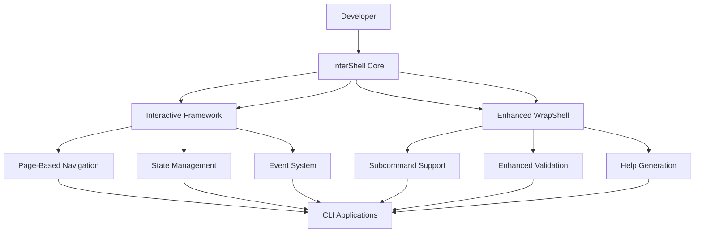
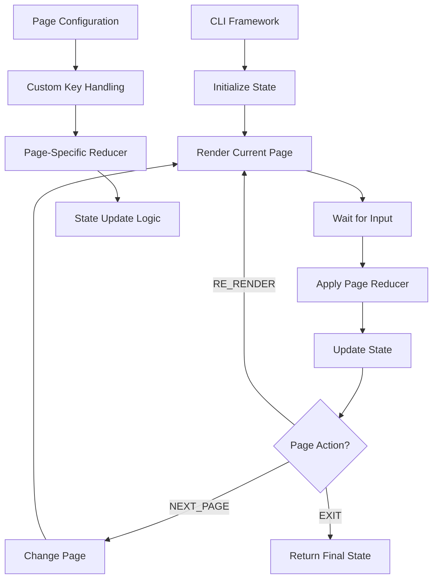

# 🎮 InterShell: CLI Framework Architecture

> **Comprehensive architecture and implementation guide for the InterShell CLI framework**

## 📋 Table of Contents

- [Overview](#-overview)
- [Current State Analysis](#-current-state-analysis)
- [Architecture Vision](#-architecture-vision)
- [Core Components](#core-components)
- [Implementation Roadmap](#implementation-roadmap)
- [Migration Strategy](#migration-strategy)
- [Design Patterns](#design-patterns)
- [Testing Strategy](#testing-strategy)
- [Performance Considerations](#performance-considerations)
- [Simplified Architecture Benefits](#simplified-architecture-benefits)

## 🎯 Overview

The InterShell CLI Framework represents the next evolution of our shell utilities and interactive CLI systems. It provides a unified, type-safe, and extensible foundation for building interactive command-line applications with modern development practices.

### **Simplified Architecture Approach** 🎯

After careful analysis, we've simplified the architecture by **eliminating the unnecessary Command Router layer** and instead **enhancing WrapShell directly with subcommand support**. This approach provides several key benefits:

#### **Why No Command Router?**
- **🚫 Redundancy**: WrapShell already handles argument parsing, validation, and execution perfectly
- **🚫 Complexity**: Adding a router layer creates unnecessary abstraction and complexity
- **🚫 Type Safety**: Router-based approaches often lose TypeScript type inference
- **🚫 Performance**: Additional routing layer adds overhead without benefits

#### **Enhanced WrapShell Benefits** ✅
- **🎯 Single Source of Truth**: One framework handles both simple scripts and complex subcommands
- **🔒 Full Type Safety**: Complete TypeScript support with automatic type inference
- **⚡ Performance**: No additional layers, direct execution
- **🧩 Simplicity**: Familiar API that developers already know and love
- **📚 Consistency**: Same validation, help generation, and error handling across all commands

#### **Real-World Example**
```typescript
// Single, unified command definition
createScript({
  name: "git",
  description: "Git version control system",
  options: [/* global options */],
  subcommands: [
    {
      name: "commit",
      description: "Create commits",
      options: [/* commit-specific options */]
    }
  ]
}, 
// Main handler
async (args, console) => { /* main logic */ },
// Subcommand handlers (type-safe!)
{
  commit: (args, console) => { /* commit logic */ }
});
```

### **Key Objectives**

1. **🎮 Generic Interactive CLI Framework**: Reusable framework for any CLI application
2. **🔧 Enhanced Script Development**: Improved script creation and management
3. **🏗️ Modular Architecture**: Clean separation of concerns and better reusability
4. **📊 Advanced State Management**: Predictable state transitions and data flow
5. **🚀 Performance Optimization**: Bun-optimized with no external dependencies
6. **🧪 Comprehensive Testing**: Full test coverage with mocking support

### **System Architecture Goals**

```typescript
interface InterShellArchitecture {
  core: {
    colorify: 'enhanced-terminal-colors';
    wrapshell: 'enhanced-script-framework-with-subcommands';
    intershell: 'generic-interactive-framework';
    cliTools: 'advanced-cli-utilities';
  };
  
  frameworks: {
    interactive: 'page-based-navigation';
    enhancedWrapshell: 'subcommand-support-and-validation';
    state: 'state-machine-management';
  };
  
  features: {
    typeSafety: '100%';
    testCoverage: '95%+';
    performance: '2x-improvement';
    extensibility: 'modular-architecture';
    developerExperience: 'first-class';
    subcommandSupport: 'built-into-wrapshell';
  };
}
```

## 📊 Current State Analysis

### **✅ What's Already Working**

The InterShell package currently provides a robust foundation that powers several key features:

#### **1. Core Utilities (`@intershell/core`)**
- **Colorify**: Enhanced terminal color utilities with RGB, HSL, and gradient support
- **WrapShell**: Advanced script creation framework with validation and hooks
- **Types**: Comprehensive type definitions for CLI applications
- **Validators**: Built-in validation system for arguments and inputs

#### **2. Entity System (`@intershell/entities`)**
- **Commit Management**: Commit parsing, validation, and PR detection
- **Changelog Generation**: Automated changelog creation with PR integration
- **Package Management**: Workspace package discovery and version management
- **Docker Integration**: Compose parsing and service health monitoring
- **Branch Validation**: Advanced branch naming and rule enforcement
- **Tag Operations**: Git tag management and version history

#### **3. Current Integration Points**
- **Commit Validation**: `scripts/commit-check.ts` uses `EntityCommit`
- **Version Management**: `scripts/version-prepare.ts` uses `EntityChangelog`
- **CI/CD Integration**: GitHub Actions workflows use entities for affected package detection
- **Development Scripts**: All development scripts use entities for common operations

### **🚧 What Needs Development**

#### **1. Interactive CLI Framework** ❌ (Not Started)
- **Page System**: Page-based navigation for complex workflows
- **State Management**: Redux-like state management with reducers
- **Event System**: Clean event-driven architecture
- **Navigation Logic**: Smart navigation between pages

#### **2. Enhanced WrapShell with Subcommands** 🚧 **TO DEVELOP**
- **Subcommand Support**: Built-in subcommand handling within WrapShell
- **Enhanced Validation**: Improved validation system for complex command structures
- **Help Generation**: Automatic help generation for all command levels
- **Type Safety**: Full TypeScript support for subcommand arguments


## 🏗️ Architecture Vision

### **High-Level Architecture**



### **Core Design Philosophy**

1. **🎯 Separation of Concerns**: Clear boundaries between I/O, logic, and presentation
2. **🔄 Event-Driven**: Clean event system for better testability and extensibility
3. **🧩 Composable**: Components can be mixed and matched for different use cases
4. **📱 Framework Agnostic**: Can be used for any CLI application or framework
5. **⚡ Performance First**: Optimized for Bun with minimal overhead
6. **🔒 Type Safe**: Full TypeScript support with strict type checking

## 🔧 Core Components

### **1. InterShell Core (`@intershell/core`)** ✅ **COMPLETE**

The foundation layer that provides essential utilities and interfaces:

```typescript
// packages/intershell/core/src/index.ts
export * from './colorify';
export * from './wrapshell';
```

#### **Colorify (`@intershell/core/colorify`)**

#### **Enhanced WrapShell (`@intershell/core/wrapshell`)**
```typescript
export class EnhancedWrapShell<TConfig extends ScriptConfig> {
  constructor(config: TConfig);
  
  // Enhanced type inference with subcommand support
  static createScript<TConfig extends ScriptConfig>(
    config: TConfig,
    mainHandler: ScriptHandler<TConfig>,
    subcommandHandlers?: SubcommandHandlers<TConfig>
  ): ScriptInstance<TConfig>;
  
  // Advanced validation system
  static validators: {
    fileExists: (path: string) => ValidationResult<string>;
    directoryExists: (path: string) => ValidationResult<string>;
    enum: <T extends string>(values: T[]) => (value: string) => ValidationResult<T>;
    regex: (pattern: RegExp, message?: string) => (value: string) => ValidationResult<string>;
    custom: <T>(validator: (value: string) => T | ValidationError) => (value: string) => ValidationResult<T>;
    url: (value: string) => ValidationResult<string>;
    email: (value: string) => ValidationResult<string>;
    semver: (value: string) => ValidationResult<string>;
  };
  
  // Hooks system
  static hooks: {
    beforeRun: (script: ScriptInstance) => Promise<void>;
    afterRun: (script: ScriptInstance, result: any) => Promise<void>;
    onError: (script: ScriptInstance, error: Error) => Promise<void>;
    onValidation: (script: ScriptInstance, input: any) => Promise<ValidationResult>;
  };
}

// Subcommand support types
interface SubcommandHandlers<TConfig extends ScriptConfig> {
  [K in TConfig['subcommands'][number]['name']]: (
    args: InferSubcommandArgs<TConfig, K>,
    console: Console
  ) => Promise<void> | void;
}

// Type inference for subcommand arguments
type InferSubcommandArgs<TConfig extends ScriptConfig, TSubcommand extends string> = {
  [K in Extract<TConfig['subcommands'][number], { name: TSubcommand }>['options'][number] as K['long'] extends `--${infer Name}` ? Name : never]: 
    K extends { required: true; type: infer T }
      ? T
      : K extends { required: false; type: infer T; defaultValue: infer D }
        ? T | D
        : T | undefined;
} & {
  verbose?: boolean;
  quiet?: boolean;
  "dry-run"?: boolean;
  help?: boolean;
};
```

### **2. Interactive Framework (`@intershell/interactive`)** 🚧 **TO DEVELOP**

The core interactive CLI framework with page-based navigation:

```typescript
// packages/intershell/interactive/src/index.ts
export * from './framework';
export * from './pages';
export * from './navigation';
export * from './state';
export * from './events';
export * from './renderers';
```

#### **CLI Framework (`@intershell/interactive/framework`)**
```typescript
export class InterShellFramework<TState, TAction> {
  constructor(
    initialState: TState,
    pages: Page<TState, TAction>[],
    reducers: ReducerMap<TState, TAction>,
    options?: FrameworkOptions
  );
  
  // Core framework methods
  async run(): Promise<TState>;
  navigateTo(pageId: string): void;
  dispatch(action: TAction): void;
  getState(): TState;
  
  // Event system
  on(event: string, handler: EventHandler): void;
  off(event: string, handler: EventHandler): void;
  emit(event: string, data?: any): void;
  
  // State management
  subscribe(listener: StateListener<TState>): void;
  getPage(pageId: string): Page<TState, TAction> | undefined;
  getCurrentPage(): Page<TState, TAction>;
  
  // Lifecycle hooks
  onPageEnter(pageId: string, callback: () => void): void;
  onPageExit(pageId: string, callback: () => void): void;
  onBeforeRender(callback: (page: Page<TState, TAction>) => void): void;
  onAfterRender(callback: (page: Page<TState, TAction>) => void): void;
}

export interface FrameworkOptions {
  debug?: boolean;
  logLevel?: 'error' | 'warn' | 'info' | 'debug';
  enableHotkeys?: boolean;
  enableHistory?: boolean;
  maxHistorySize?: number;
  renderMode?: 'immediate' | 'debounced' | 'throttled';
  renderDelay?: number;
}
```

#### **Page System (`@intershell/interactive/pages`)**
```typescript
export interface Page<TState, TAction> {
  id: string;
  title: string;
  description?: string;
  icon?: string;
  
  // Page logic
  render(cli: InteractiveCLI, state: TState): Promise<void>;
  handleKey(key: KeyPress, state: TState): TAction | null;
  getNextAction(state: TState): PageAction;
  
  // Navigation
  canNavigateTo(targetPage: string, state: TState): boolean;
  onEnter(state: TState): void;
  onExit(state: TState): void;
  
  // Validation
  validate?(state: TState): ValidationResult;
  canSkip?(state: TState): boolean;
  
  // Metadata
  metadata?: {
    tags?: string[];
    category?: string;
    difficulty?: 'easy' | 'medium' | 'hard';
    estimatedTime?: number;
  };
}

export type PageAction = 
  | { type: 'NEXT_PAGE' }
  | { type: 'PREV_PAGE' }
  | { type: 'CHANGE_PAGE'; payload: string }
  | { type: 'RE_RENDER' }
  | { type: 'EXIT' }
  | { type: 'CUSTOM'; payload: any };
```

### **3. Enhanced WrapShell Subcommand Examples** 🚧 **TO DEVELOP**

Real-world examples of how enhanced WrapShell handles subcommands:

```typescript
// Example: Git-like CLI with subcommands
const gitScript = createScript({
  name: "git",
  description: "Git version control system",
  options: [
    {
      short: "-h",
      long: "--help",
      description: "Show help",
      validator: validators.boolean
    }
  ],
  subcommands: [
    {
      name: "commit",
      description: "Create and manage commits",
      options: [
        {
          short: "-m",
          long: "--message",
          description: "Commit message",
          required: true,
          validator: validators.nonEmpty
        },
        {
          short: "-a",
          long: "--all",
          description: "Stage all changes",
          validator: validators.boolean
        }
      ]
    },
    {
      name: "push",
      description: "Push commits to remote",
      options: [
        {
          short: "-u",
          long: "--set-upstream",
          description: "Set upstream branch",
          validator: validators.boolean
        }
      ]
    }
  ]
}, 
// Main handler for git command
async (args, console) => {
  if (args.help) {
    console.log("Git - Distributed version control system");
    return;
  }
  console.log("Use subcommands: commit, push, pull, etc.");
},
// Subcommand handlers
{
  commit: async (args, console) => {
    console.log(`Committing with message: ${args.message}`);
    if (args.all) {
      console.log("Staging all changes");
    }
  },
  push: async (args, console) => {
    if (args["set-upstream"]) {
      console.log("Setting upstream branch");
    }
    console.log("Pushing to remote");
  }
});
```


## 🚀 Implementation Roadmap

### **Phase 1: Foundation Layer** (Week 1-2)

#### **1.1 Interactive CLI Foundation** 🚧 **TO DEVELOP**
- **Purpose**: Low-level I/O foundation with event-based architecture
- **Current State**: Promise-based methods with complex state management
- **Target State**: Event emitter with controlled Promise management
- **Key Changes**:
  - Remove Promise-based methods (`select`, `prompt`, `confirm`)
  - Add `createControlledPromise()`, `resolveCurrentPromise()`, `rejectCurrentPromise()`
  - Convert to event-based key handling with `onKeyPress()`/`offKeyPress()`
  - Keep screen management utilities (`clearScreen`, `showCursor`, `hideCursor`)

#### **1.2 Framework Layer** 🚧 **TO DEVELOP**
- **Purpose**: Reusable CLI framework with state machine pattern
- **Architecture**: While loop + controlled Promise + reducer pattern
- **Features**:
  - Generic state management for any CLI application
  - Page-based navigation with custom reducers
  - Full control over re-rendering and flow
  - Event-driven input handling

#### **1.3 Page Configuration System** 🚧 **TO DEVELOP**
- **Purpose**: Define page interfaces and action types
- **Structure**:
  - `Page<TState>` interface with custom key handling
  - `PageAction` union types for navigation
  - `ReducerMap<TState>` for state updates
  - Each page defines its own reducer and key logic

### **Phase 2: Interactive Framework** (Week 3-4)

#### **2.1 Page System Implementation**
- **Page Builder**: Fluent API for creating pages
- **Navigation Logic**: Smart navigation between pages
- **State Validation**: Page-level state validation
- **Metadata System**: Page categorization and organization

#### **2.2 State Management**
- **Reducer Pattern**: Redux-like state management
- **State Persistence**: Optional state persistence
- **State Validation**: Comprehensive state validation
- **State History**: Undo/redo functionality

#### **2.3 Event System**
- **Event Emitter**: Clean event system
- **Middleware Support**: Event middleware and hooks
- **Event History**: Event logging and debugging
- **Custom Events**: Framework for custom events

### **Phase 3: Enhanced WrapShell Subcommands** (Week 5-6)

#### **3.1 Subcommand Support**
- **Subcommand Definition**: Define subcommands in script configuration
- **Option Inheritance**: Global options available to all subcommands
- **Validation**: Subcommand-specific validation rules
- **Type Safety**: Full TypeScript support for subcommand arguments

#### **3.2 Enhanced Help System**
- **Automatic Help Generation**: Help for main command and all subcommands
- **Usage Examples**: Command usage examples with subcommand variations
- **Markdown Support**: Rich help formatting for documentation
- **Interactive Help**: Interactive help navigation

#### **3.3 Subcommand Execution**
- **Handler Registration**: Type-safe subcommand handler registration
- **Argument Parsing**: Intelligent argument parsing for subcommands
- **Error Handling**: Comprehensive error handling and validation
- **Performance**: Optimized subcommand execution


### **Phase 4: Integration & Testing** (Week 7-8)

#### **4.1 Framework Integrations**
- **React Integration**: React hooks for InterShell
- **Vue Integration**: Vue composables for InterShell
- **Svelte Integration**: Svelte stores for InterShell
- **Vanilla JS**: Vanilla JavaScript integration

#### **4.2 Testing & Validation**
- **Unit Tests**: Comprehensive unit testing
- **Integration Tests**: End-to-end testing
- **Performance Tests**: Performance benchmarking
- **Documentation**: Complete API documentation

## 🔄 Migration Strategy

### **Current Commit Workflow** ❌ (Needs Migration)

The current `scripts/commit.ts` uses a complex `runEnhancedInteractiveMode` function:

```typescript
// Current complex implementation
async function runEnhancedInteractiveMode(): Promise<void> {
  let currentStage = 'select-files';
  let state = { /* complex state object */ };
  
  while (currentStage !== 'exit') {
    switch (currentStage) {
      case 'select-files':
        // Complex logic for file selection
        break;
      case 'commit-message':
        // Complex logic for commit message
        break;
      // ... more cases
    }
  }
}
```

### **New CLI Workflow Design** ✅ (Target Architecture)



### **Migration Benefits**

- **Separation of Concerns**: I/O foundation vs application logic
- **Reusability**: Generic framework for any CLI application
- **Maintainability**: Clear state transitions and page logic
- **Performance**: Bun-optimized with no external dependencies
- **Testing**: Test pages and reducers independently

### **Migration Steps**

#### **Step 1: Create Foundation Layer**
```typescript
// New interactive-cli.ts
export class InteractiveCLI {
  // Event-based I/O foundation
  run(): void;
  cleanup(): void;
  
  // Controlled Promise management
  createControlledPromise<T>(): Promise<T>;
  resolveCurrentPromise(value: any): void;
  rejectCurrentPromise(reason: any): void;
  
  // Event-based key handling
  onKeyPress(callback: (key: KeyPress) => void): void;
  offKeyPress(callback: (key: KeyPress) => void): void;
  
  // Screen management utilities
  clearScreen(): void;
  showCursor(): void;
  hideCursor(): void;
}
```

#### **Step 2: Create Framework Layer**
```typescript
// New cli-framework.ts
export class CLIFramework<TState> {
  constructor(
    initialState: TState,
    pages: Page<TState>[],
    reducers: ReducerMap<TState>
  );
  
  async run(): Promise<TState>;  // Main application loop
}
```

#### **Step 3: Create Page Configuration**
```typescript
// New page-types.ts
export interface Page<TState> {
  id: string;
  title: string;
  description: string;
  
  // Page-specific key handling
  handleKey: (key: KeyPress, state: TState) => any | null;
  
  // Page-specific reducer
  reducer: (state: TState, action: any) => TState;
  
  // Page decides next action
  getNextAction: (state: TState) => PageAction;
  
  // Render logic
  render: (cli: InteractiveCLI, state: TState) => Promise<void>;
}

export type PageAction = 
  | { type: 'NEXT_PAGE' }
  | { type: 'PREV_PAGE' }
  | { type: 'CHANGE_PAGE'; payload: string }
  | { type: 'RE_RENDER' }
  | { type: 'EXIT' };

export type ReducerMap<TState> = Record<string, (state: TState, action: any) => TState>;
```

#### **Step 4: Migrate Commit Workflow**
```typescript
// New commit.ts using framework
const pages = [
  createFileSelectionPage(),
  createCommitMessagePage(),
  createConfirmationPage(),
];

const reducers = {
  SELECT_FILES: (state, action) => ({ ...state, files: action.payload }),
  SET_MESSAGE: (state, action) => ({ ...state, message: action.payload }),
  SET_STAGED: (state, action) => ({ ...state, staged: action.payload }),
};

const framework = new CLIFramework(initialState, pages, reducers);
const finalState = await framework.run();
```

## 🎨 Design Patterns

### **1. Composition Over Inheritance**

```typescript
// Good: Composition
const framework = new InterShellFramework(
  initialState,
  pages,
  reducers,
  { 
    renderers: [new ConsoleRenderer(), new HTMLRenderer()]
  }
);

// Avoid: Inheritance
class MyFramework extends InterShellFramework {
  // This creates tight coupling and makes testing harder
}
```

### **2. Configuration Over Convention**

```typescript
// Explicit configuration
const page = new Page({
  id: 'commit-message',
  title: 'Commit Message',
  description: 'Enter your commit message',
  render: async (cli, state) => { /* custom render logic */ },
  handleKey: (key, state) => { /* custom key handling */ },
  validation: (state) => { /* custom validation */ }
});

// Avoid magic behavior
class CommitMessagePage extends Page {
  // Magic behavior based on class name or inheritance
}
```

### **3. Immutability and Pure Functions**

```typescript
// Good: Pure functions
const reducer = (state: State, action: Action): State => {
  switch (action.type) {
    case 'UPDATE_MESSAGE':
      return { ...state, message: action.payload };
    case 'CLEAR_MESSAGE':
      return { ...state, message: '' };
    default:
      return state;
  }
};

// Avoid: Mutating state
const reducer = (state: State, action: Action): State => {
  switch (action.type) {
    case 'UPDATE_MESSAGE':
      state.message = action.payload; // ❌ Mutation
      return state;
  }
};
```

### **4. Event-Driven Architecture**

```typescript
// Good: Event-driven
framework.on('pageChange', (from, to) => {
  console.log(`Navigated from ${from} to ${to}`);
});

framework.on('stateChange', (oldState, newState) => {
  analytics.track('state_change', { oldState, newState });
});

// Avoid: Direct method calls
framework.pageChangeCallback = (from, to) => { /* ... */ }; // ❌ Tight coupling
```

## 🧪 Testing Strategy

### **Phase 1: Foundation Testing**
- Test event-based key handling
- Test controlled Promise management
- Test screen management utilities

### **Phase 2: Framework Testing**
- Test generic state management
- Test page navigation logic
- Test reducer pattern implementation

### **Phase 3: Application Testing**
- Test commit workflow with new framework
- Test page transitions and state updates
- Test error handling and recovery

### **Phase 4: Integration Testing**
- Test complete CLI applications
- Test framework reusability
- Test performance and resource usage

### **Testing Examples**

```typescript
// Unit tests
describe('InterShell Framework', () => {
  it('should initialize with initial state', () => {
    const framework = new InterShellFramework(initialState, pages, reducers);
    expect(framework.getState()).toEqual(initialState);
  });
  
  it('should navigate between pages', async () => {
    const framework = new InterShellFramework(initialState, pages, reducers);
    await framework.navigateTo('second-page');
    expect(framework.getCurrentPage().id).toBe('second-page');
  });
});

// Integration tests
describe('CLI Application Integration', () => {
  it('should run complete workflow', async () => {
    const app = createTestApp();
    const result = await app.run();
    expect(result).toMatchSnapshot();
  });
});

// Performance tests
describe('Performance Tests', () => {
  it('should handle large state updates efficiently', () => {
    const startTime = performance.now();
    // Perform large state update
    const endTime = performance.now();
    expect(endTime - startTime).toBeLessThan(100); // Under 100ms
  });
});
```

## ⚡ Performance Considerations

### **Bun Optimization**
- **Zero Dependencies**: Built from the ground up for Bun
- **Fast Startup**: Minimal overhead during initialization
- **Memory Efficiency**: Optimized memory usage patterns
- **Hot Reload**: Fast development iteration

### **State Management**
- **Immutable Updates**: Efficient state updates
- **Selective Rendering**: Only render changed components
- **Lazy Loading**: Load pages on demand
- **Caching**: Smart caching of expensive operations

### **Event System**
- **Event Batching**: Batch multiple events together
- **Debounced Rendering**: Prevent excessive re-renders
- **Event Filtering**: Filter irrelevant events
- **Memory Management**: Proper event cleanup

### **Modular Architecture**
- **Component Composition**: Mix and match components as needed
- **Dependency Management**: Efficient dependency resolution
- **Component Isolation**: Prevent component conflicts
- **Performance Monitoring**: Monitor component performance

## 🔮 Future Roadmap

### **Phase 1: Foundation (Months 1-3)**
- [ ] Core package structure and architecture
- [ ] Basic interactive framework
- [ ] Enhanced WrapShell with subcommand support
- [ ] Core utilities and types

### **Phase 2: Framework (Months 4-6)**
- [ ] Advanced page system
- [ ] State management and persistence
- [ ] Event system and middleware
- [ ] Advanced validation and error handling
- [ ] Performance optimization

### **Phase 3: Ecosystem (Months 7-9)**
- [ ] Framework integrations
- [ ] Advanced renderers
- [ ] Developer tools and debugging
- [ ] Documentation and examples

### **Phase 4: Enterprise (Months 10-12)**
- [ ] Multi-user support
- [ ] Role-based access control
- [ ] Audit logging and compliance
- [ ] Enterprise integrations
- [ ] Performance monitoring

### **Long-term Vision**
- **AI Integration**: AI-powered command suggestions and automation
- **Cloud Sync**: Synchronize CLI state and preferences across devices
- **Collaborative CLI**: Multi-user CLI sessions for team collaboration
- **Visual Programming**: Visual CLI builder for non-developers
- **Mobile Support**: Mobile-optimized CLI interfaces

## 🔗 Related Documentation

- [InterShell README](./README.md) - Overview and planning
- [InterShell Architecture](./INTERSHELL_ARCHITECTURE.md) - Detailed architecture
- [CLI Framework Migration](./CLI_FRAMEWORK_MIGRATION.md) - Migration plan
- [Scripting Guide](../../4_INTERSHELL.md) - Current scripting system
- [Development Flows](../../3_DEV_FLOWS.md) - Development workflows
- [Auto Versioning](../../7_AUTO_VERSIONING.md) - Version management system

## 🎯 Simplified Architecture Benefits

### **1. Eliminated Complexity** ✅

By removing the Command Router layer, we've eliminated several sources of complexity:

- **🚫 No Command Registration**: Commands are defined directly in script configuration
- **🚫 No Routing Logic**: Direct execution without intermediate routing
- **🚫 No Command Discovery**: All commands are statically defined and type-safe
- **🚫 No Middleware Complexity**: Simple, direct execution flow

### **2. Enhanced Developer Experience** 🚀

The simplified approach provides a better developer experience:

- **🎯 Single API**: One `createScript` function handles everything
- **🔒 Type Safety**: Full TypeScript support with automatic type inference
- **📚 Familiar Patterns**: Developers already know WrapShell patterns
- **🧪 Easy Testing**: No complex routing to mock or test

### **3. Performance Improvements** ⚡

Direct execution without routing layers provides better performance:

- **🚀 Faster Startup**: No command discovery or registration overhead
- **💾 Lower Memory**: No command registry or routing tables
- **⚡ Direct Execution**: Commands execute immediately without routing
- **🔄 No Caching**: No need for command caching or lookup optimization

### **4. Maintenance Benefits** 🛠️

Simpler architecture means easier maintenance:

- **🔍 Clear Code Path**: Easy to trace execution flow
- **📝 Simple Debugging**: No complex routing logic to debug
- **🧹 Less Code**: Fewer files, fewer abstractions, less complexity
- **📚 Better Documentation**: Simpler concepts are easier to document

---

**InterShell CLI Framework Architecture**: This document provides a comprehensive implementation guide for the InterShell CLI framework, consolidating all planning information and providing a clear roadmap for development. The framework will be built on the solid foundation of the existing entity system while adding powerful new interactive capabilities and enhanced WrapShell subcommand support.
