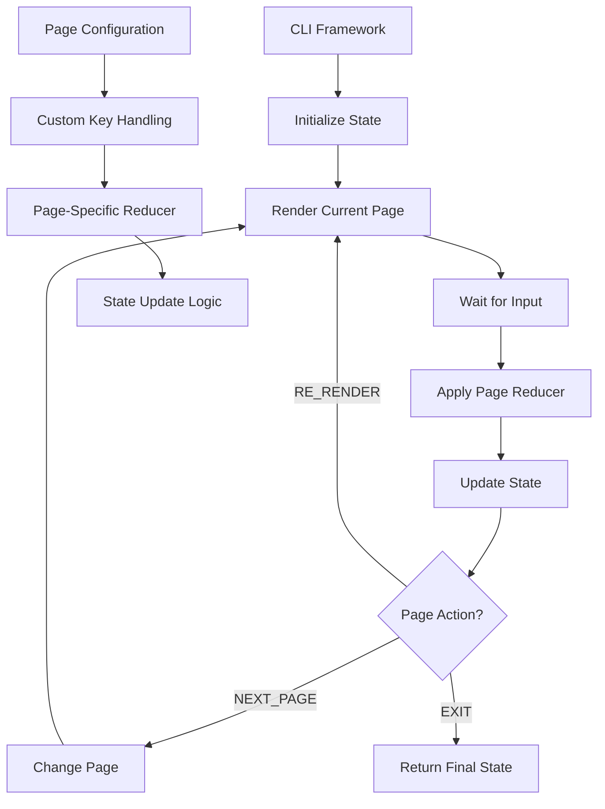

# 🎮 InterShell: CLI Framework Migration Plan

> **Comprehensive plan to refactor the interactive CLI system into a generic, reusable framework**

## 📋 Table of Contents

- [Overview](#-overview)
- [Current State](#-current-state)
- [Migration Goals](#-migration-goals)
- [New CLI Architecture](#-new-cli-architecture)
- [Implementation Phases](#-implementation-phases)
- [Testing Strategy](#-testing-strategy)
- [CLI Framework Landscape](#cli-framework-landscape)

## 🎯 Overview

The current interactive CLI system in `scripts/shell/interactive-cli.ts` uses Promise-based methods with complex state management. We need to refactor this into a clean, event-driven foundation that can be used by a generic CLI framework. This will allow us to escape the complex `runEnhancedInteractiveMode` function and create reusable CLI applications.

## ✅ Current State

### **Current Interactive CLI** ❌ (Needs Refactoring)
- **`interactive-cli.ts`**: Promise-based methods (`select`, `prompt`, `confirm`) with complex state management
- **`commit.ts`**: Complex `runEnhancedInteractiveMode` function with hardcoded workflow logic
- **Architecture**: Tightly coupled I/O handling and application logic
- **Reusability**: Limited - each CLI app needs custom implementation

### **Current Commit Workflow** ❌ (Needs Migration)
- **Complex while loop** with manual state management
- **Hardcoded navigation** logic
- **Mixed concerns** between I/O handling and business logic
- **Difficult to test** and maintain

## 🎯 Migration Goals

1. **Separate Concerns**: I/O foundation vs application logic
2. **Create Generic Framework**: Reusable CLI framework for any application
3. **Escape Complex Logic**: Replace `runEnhancedInteractiveMode` with clean page configuration
4. **Improve Maintainability**: Clear state transitions and page logic
5. **Enhance Testing**: Test pages and reducers independently

## 🏗️ New CLI Architecture

### **Foundation Layer** - `interactive-cli.ts`
```typescript
export class InteractiveCLI {
  // Event-based I/O foundation
  run(): void                    // Start I/O handling
  cleanup(): void               // Cleanup resources
  
  // Controlled Promise management
  createControlledPromise<T>(): Promise<T>
  resolveCurrentPromise(value: any): void
  rejectCurrentPromise(reason: any): void
  
  // Event-based key handling
  onKeyPress(callback: (key: KeyPress) => void): void
  offKeyPress(callback: (key: KeyPress) => void): void
  
  // Screen management utilities
  clearScreen(): void
  showCursor(): void
  hideCursor(): void
}
```

### **Framework Layer** - `cli-framework.ts`
```typescript
export class CLIFramework<TState> {
  constructor(
    initialState: TState,
    pages: Page<TState>[],
    reducers: ReducerMap<TState>
  )
  
  async run(): Promise<TState>  // Main application loop
}
```

### **Page Configuration** - `page-types.ts`
```typescript
export interface Page<TState> {
  id: string
  title: string
  description: string
  
  // Page-specific key handling
  handleKey: (key: KeyPress, state: TState) => any | null
  
  // Page-specific reducer
  reducer: (state: TState, action: any) => TState
  
  // Page decides next action
  getNextAction: (state: TState) => PageAction
  
  // Render logic
  render: (cli: InteractiveCLI, state: TState) => Promise<void>
}

export type PageAction = 
  | { type: 'NEXT_PAGE' }
  | { type: 'PREV_PAGE' }
  | { type: 'CHANGE_PAGE'; payload: string }
  | { type: 'RE_RENDER' }
  | { type: 'EXIT' }

export type ReducerMap<TState> = Record<string, (state: TState, action: any) => TState>
```

## 🔄 **CLI Framework Migration**

### **New CLI Architecture Required**

#### 1. **`interactive-cli.ts` - Foundation Layer** ❌ (To Refactor)
- **Purpose**: Low-level I/O foundation with event-based architecture
- **Current State**: Promise-based methods with complex state management
- **Target State**: Event emitter with controlled Promise management
- **Key Changes**:
  - Remove Promise-based methods (`select`, `prompt`, `confirm`)
  - Add `createControlledPromise()`, `resolveCurrentPromise()`, `rejectCurrentPromise()`
  - Convert to event-based key handling with `onKeyPress()`/`offKeyPress()`
  - Keep screen management utilities (`clearScreen`, `showCursor`, `hideCursor`)

#### 2. **`cli-framework.ts` - Generic Application Framework** ❌ (To Create)
- **Purpose**: Reusable CLI framework with state machine pattern
- **Architecture**: While loop + controlled Promise + reducer pattern
- **Features**:
  - Generic state management for any CLI application
  - Page-based navigation with custom reducers
  - Full control over re-rendering and flow
  - Event-driven input handling

#### 3. **`page-types.ts` - Page Configuration System** ❌ (To Create)
- **Purpose**: Define page interfaces and action types
- **Structure**:
  - `Page<TState>` interface with custom key handling
  - `PageAction` union types for navigation
  - `ReducerMap<TState>` for state updates
  - Each page defines its own reducer and key logic

#### 4. **`commit.ts` - Application Implementation** ❌ (To Refactor)
- **Purpose**: Use new CLI framework for commit workflow
- **Current State**: Complex `runEnhancedInteractiveMode` function
- **Target State**: Clean page configuration with custom reducers
- **Benefits**:
  - Escape from complex while loop logic
  - Page-specific key handling and state updates
  - Reusable framework for other CLI tools

### **New CLI Workflow Design**


### **Migration Benefits**
- **Separation of Concerns**: I/O foundation vs application logic
- **Reusability**: Generic framework for any CLI application
- **Maintainability**: Clear state transitions and page logic
- **Performance**: Bun-optimized with no external dependencies
- **Testing**: Test pages and reducers independently

## 📅 Implementation Phases

#### **Phase 1: Foundation Layer** (Week 1)
- [ ] Refactor `InteractiveCLI` to event-based architecture
- [ ] Add controlled Promise management
- [ ] Remove Promise-based methods
- [ ] Add event emitter for key handling

#### **Phase 2: Framework Layer** (Week 2)
- [ ] Create `CLIFramework` class with generic state management
- [ ] Implement while loop with controlled Promise pattern
- [ ] Add page navigation and state machine logic
- [ ] Create base page interfaces and action types

#### **Phase 3: Application Layer** (Week 3)
- [ ] Define commit-specific pages with custom reducers
- [ ] Migrate commit workflow to new framework
- [ ] Test page transitions and state updates
- [ ] Validate re-rendering and navigation logic

#### **Phase 4: Testing & Documentation** (Week 4)
- [ ] Unit tests for pages and reducers
- [ ] Integration tests for complete workflows
- [ ] Update documentation with new architecture
- [ ] Create examples for other CLI applications

## 🧪 Testing Strategy

### **Phase 1: Foundation Testing**
- Test event-based key handling
- Test controlled Promise management
- Test screen management utilities

### **Phase 2: Framework Testing**
- Test generic state management
- Test page navigation logic
- Test reducer pattern implementation

### **Phase 3: Application Testing**
- Test commit workflow with new framework
- Test page transitions and state updates
- Test error handling and recovery

### **Phase 4: Integration Testing**
- Test complete CLI applications
- Test framework reusability
- Test performance and resource usage

## 🌐 CLI Framework Landscape

Based on research into existing CLI frameworks, here are the key patterns and approaches we can learn from:

### **Popular CLI Frameworks**

#### **JavaScript/Node.js**
- **Commander.js**: Complete solution for Node.js CLI interfaces
- **Yargs**: Interactive command-line tools with argument parsing
- **Oclif**: Heroku's CLI framework with plugin architecture
- **Gluegun**: Toolkit for building command-line interfaces

#### **Go**
- **Cobra**: Powerful CLI framework used by Kubernetes and Hugo
- **cli**: Simple, fast package for building CLI apps
- **urfave/cli**: Simple, fast, and fun package for building CLI apps

#### **Python**
- **Click**: Package for creating command-line interfaces
- **Typer**: Modern Python library for building CLI applications
- **argparse**: Standard library module for argument parsing

#### **Rust**
- **clap**: Feature-rich command line argument parser
- **structopt**: Parse command line arguments by defining a struct

### **Key Design Patterns**

#### **1. Command Structure**
```typescript
// Commander.js pattern
program
  .command('commit')
  .description('Create a new commit')
  .option('-m, --message <message>', 'commit message')
  .option('-a, --all', 'stage all files')
  .action(async (options) => {
    // Command logic
  });
```

#### **2. Interactive Prompts**
```typescript
// Inquirer.js pattern
const answers = await inquirer.prompt([
  {
    type: 'input',
    name: 'message',
    message: 'What is your commit message?',
    validate: (input) => input.length > 0 ? true : 'Message is required'
  }
]);
```

#### **3. State Management**
```typescript
// Redux-like pattern
interface CLIState {
  currentPage: string;
  userInput: Record<string, any>;
  navigation: NavigationState;
}

type CLIAction = 
  | { type: 'NAVIGATE'; payload: string }
  | { type: 'UPDATE_INPUT'; payload: { key: string; value: any } }
  | { type: 'RESET' };
```

#### **4. Plugin Architecture**
```typescript
// Oclif pattern
export class MyCLI extends Command {
  static description = 'My CLI command';
  static flags = {
    help: flags.help({ char: 'h' }),
    version: flags.version({ char: 'v' })
  };
  
  async run() {
    // Command implementation
  }
}
```

### **Lessons for Our Framework**

#### **Strengths to Adopt**
1. **Command Structure**: Clear separation of commands and options
2. **Interactive Prompts**: User-friendly input collection
3. **Plugin System**: Extensible architecture for commands
4. **Help System**: Comprehensive help and documentation
5. **Validation**: Input validation and error handling

#### **Innovations to Implement**
1. **Page-Based Navigation**: Visual page system for complex workflows
2. **State Machine**: Predictable state transitions
3. **Event-Driven Architecture**: Clean separation of concerns
4. **Bun Optimization**: Leverage Bun's performance benefits
5. **TypeScript First**: Full type safety from the ground up

## 🚀 Next Steps

1. **Start Phase 1**: Refactor `InteractiveCLI` to event-based architecture
2. **Create Foundation**: Build controlled Promise management system
3. **Design Framework**: Plan generic CLI framework structure
4. **Implement Pages**: Create page configuration system
5. **Migrate Commit**: Move commit workflow to new framework

---

**Status**: 🎯 **READY TO START** - InterShell CLI Framework Migration Phase 1
