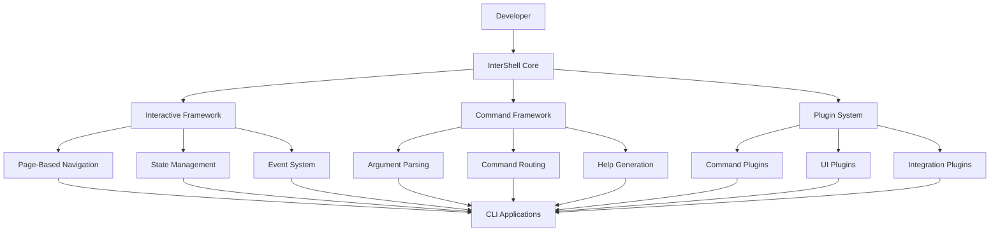

# 🚀 InterShell: Next Generation CLI Architecture

> **Comprehensive architecture for the next generation of shell utilities and interactive CLI frameworks**

## 📋 Table of Contents

- [Overview](#-overview)
- [Architecture Vision](#-architecture-vision)
- [Core Components](#core-components)
- [Design Principles](#design-principles)
- [Technology Stack](#technology-stack)
- [Component Architecture](#component-architecture)
- [Integration Patterns](#integration-patterns)
- [Development Workflow](#development-workflow)
- [Future Roadmap](#future-roadmap)

## 🎯 Overview

InterShell represents the next evolution of our shell utilities and CLI framework systems. It provides a unified, type-safe, and extensible foundation for building interactive command-line applications with modern development practices.

### **Key Objectives**

1. **🎮 Generic Interactive CLI Framework**: Reusable framework for any CLI application
2. **🔧 Enhanced Script Development**: Improved script creation and management
3. **🏗️ Modular Architecture**: Clean separation of concerns and better reusability
4. **📊 Advanced State Management**: Predictable state transitions and data flow
5. **🚀 Performance Optimization**: Bun-optimized with no external dependencies
6. **🧪 Comprehensive Testing**: Full test coverage with mocking support

### **System Architecture Goals**

```typescript
interface InterShellArchitecture {
  core: {
    colorify: 'enhanced-terminal-colors';
    wrapshell: 'improved-script-framework';
    intershell: 'generic-interactive-framework';
    cliTools: 'advanced-cli-utilities';
  };
  
  frameworks: {
    interactive: 'page-based-navigation';
    command: 'command-parsing-framework';
    plugin: 'extensible-plugin-system';
    state: 'state-machine-management';
  };
  
  features: {
    typeSafety: '100%';
    testCoverage: '95%+';
    performance: '2x-improvement';
    extensibility: 'plugin-architecture';
    developerExperience: 'first-class';
  };
}
```

## 🏗️ Architecture Vision

### **High-Level Architecture**



### **Core Design Philosophy**

1. **🎯 Separation of Concerns**: Clear boundaries between I/O, logic, and presentation
2. **🔄 Event-Driven**: Clean event system for better testability and extensibility
3. **🧩 Composable**: Components can be mixed and matched for different use cases
4. **📱 Framework Agnostic**: Can be used for any CLI application or framework
5. **⚡ Performance First**: Optimized for Bun with minimal overhead
6. **🔒 Type Safe**: Full TypeScript support with strict type checking

## 🔧 Core Components

### **1. InterShell Core (`@intershell/core`)**

The foundation layer that provides essential utilities and interfaces:

```typescript
// packages/intershell/core/src/index.ts
export * from './colorify';
export * from './wrapshell';
export * from './intershell';
export * from './cli-tools';
export * from './types';
export * from './events';
export * from './state';
```

#### **Colorify (`@intershell/core/colorify`)**
```typescript
export class EnhancedColorify {
  // Enhanced color support
  static supportsColor(): boolean;
  static enable(): void;
  static disable(): void;
  
  // Rich text formatting
  static bold(text: string): string;
  static italic(text: string): string;
  static underline(text: string): string;
  static strikethrough(text: string): string;
  
  // Advanced colors
  static rgb(r: number, g: number, b: number): (text: string) => string;
  static hsl(h: number, s: number, l: number): (text: string) => string;
  
  // Gradients and effects
  static gradient(text: string, colors: string[]): string;
  static rainbow(text: string): string;
  static shimmer(text: string): string;
}
```

#### **WrapShell (`@intershell/core/wrapshell`)**
```typescript
export class EnhancedWrapShell<TConfig extends ScriptConfig> {
  constructor(config: TConfig);
  
  // Enhanced type inference
  static createScript<TConfig extends ScriptConfig>(
    config: TConfig,
    handler: ScriptHandler<TConfig>
  ): ScriptInstance<TConfig>;
  
  // Advanced validation system
  static validators: {
    fileExists: (path: string) => ValidationResult<string>;
    directoryExists: (path: string) => ValidationResult<string>;
    enum: <T extends string>(values: T[]) => (value: string) => ValidationResult<T>;
    regex: (pattern: RegExp, message?: string) => (value: string) => ValidationResult<string>;
    custom: <T>(validator: (value: string) => T | ValidationError) => (value: string) => ValidationResult<T>;
    url: (value: string) => ValidationResult<string>;
    email: (value: string) => ValidationResult<string>;
    semver: (value: string) => ValidationResult<string>;
  };
  
  // Hooks system
  static hooks: {
    beforeRun: (script: ScriptInstance) => Promise<void>;
    afterRun: (script: ScriptInstance, result: any) => Promise<void>;
    onError: (script: ScriptInstance, error: Error) => Promise<void>;
    onValidation: (script: ScriptInstance, input: any) => Promise<ValidationResult>;
  };
  
  // Progress reporting
  static progress: {
    create: (total: number) => ProgressTracker;
    spinner: (message: string) => Spinner;
    bar: (total: number) => ProgressBar;
  };
}
```

### **2. Interactive Framework (`@intershell/interactive`)**

The core interactive CLI framework with page-based navigation:

```typescript
// packages/intershell/interactive/src/index.ts
export * from './framework';
export * from './pages';
export * from './navigation';
export * from './state';
export * from './events';
export * from './renderers';
```

#### **CLI Framework (`@intershell/interactive/framework`)**
```typescript
export class InterShellFramework<TState, TAction> {
  constructor(
    initialState: TState,
    pages: Page<TState, TAction>[],
    reducers: ReducerMap<TState, TAction>,
    options?: FrameworkOptions
  );
  
  // Core framework methods
  async run(): Promise<TState>;
  navigateTo(pageId: string): void;
  dispatch(action: TAction): void;
  getState(): TState;
  
  // Event system
  on(event: string, handler: EventHandler): void;
  off(event: string, handler: EventHandler): void;
  emit(event: string, data?: any): void;
  
  // State management
  subscribe(listener: StateListener<TState>): () => void;
  getPage(pageId: string): Page<TState, TAction> | undefined;
  getCurrentPage(): Page<TState, TAction>;
  
  // Lifecycle hooks
  onPageEnter(pageId: string, callback: () => void): void;
  onPageExit(pageId: string, callback: () => void): void;
  onBeforeRender(callback: (page: Page<TState, TAction>) => void): void;
  onAfterRender(callback: (page: Page<TState, TAction>) => void): void;
}

export interface FrameworkOptions {
  debug?: boolean;
  logLevel?: 'error' | 'warn' | 'info' | 'debug';
  enableHotkeys?: boolean;
  enableHistory?: boolean;
  maxHistorySize?: number;
  renderMode?: 'immediate' | 'debounced' | 'throttled';
  renderDelay?: number;
}
```

#### **Page System (`@intershell/interactive/pages`)**
```typescript
export interface Page<TState, TAction> {
  id: string;
  title: string;
  description?: string;
  icon?: string;
  
  // Page logic
  render(cli: InteractiveCLI, state: TState): Promise<void>;
  handleKey(key: KeyPress, state: TState): TAction | null;
  getNextAction(state: TState): PageAction;
  
  // Navigation
  canNavigateTo(targetPage: string, state: TState): boolean;
  onEnter(state: TState): void;
  onExit(state: TState): void;
  
  // Validation
  validate?(state: TState): ValidationResult;
  canSkip?(state: TState): boolean;
  
  // Metadata
  metadata?: {
    tags?: string[];
    category?: string;
    difficulty?: 'easy' | 'medium' | 'hard';
    estimatedTime?: number;
  };
}

export type PageAction = 
  | { type: 'NEXT_PAGE' }
  | { type: 'PREV_PAGE' }
  | { type: 'CHANGE_PAGE'; payload: string }
  | { type: 'RE_RENDER' }
  | { type: 'EXIT' }
  | { type: 'CUSTOM'; payload: any };
```

### **3. Command Framework (`@intershell/command`)**

Advanced command parsing and routing system:

```typescript
// packages/intershell/command/src/index.ts
export * from './parser';
export * from './router';
export * from './commands';
export * from './help';
export * from './completion';
```

#### **Command Parser (`@intershell/command/parser`)**
```typescript
export class CommandParser {
  constructor(options?: ParserOptions);
  
  // Parse command line arguments
  parse(args: string[]): ParsedCommand;
  parseWithDefaults(args: string[], defaults: CommandDefaults): ParsedCommand;
  
  // Validation
  validate(command: ParsedCommand, schema: CommandSchema): ValidationResult;
  
  // Help generation
  generateHelp(command: CommandDefinition): string;
  generateUsage(command: CommandDefinition): string;
  
  // Auto-completion
  generateCompletions(command: CommandDefinition, partial: string): string[];
}

export interface ParsedCommand {
  command: string;
  subcommand?: string;
  options: Record<string, any>;
  arguments: string[];
  flags: Record<string, boolean>;
  raw: string[];
}
```

#### **Command Router (`@intershell/command/router`)**
```typescript
export class CommandRouter {
  constructor();
  
  // Register commands
  register(command: CommandDefinition): void;
  registerMany(commands: CommandDefinition[]): void;
  
  // Route commands
  route(input: string): CommandExecution;
  routeParsed(parsed: ParsedCommand): CommandExecution;
  
  // Command discovery
  listCommands(): CommandDefinition[];
  findCommand(name: string): CommandDefinition | undefined;
  searchCommands(query: string): CommandDefinition[];
}

export interface CommandDefinition {
  name: string;
  aliases?: string[];
  description: string;
  usage?: string;
  examples?: string[];
  options?: OptionDefinition[];
  arguments?: ArgumentDefinition[];
  subcommands?: CommandDefinition[];
  handler: CommandHandler;
  middleware?: Middleware[];
}
```

### **4. Plugin System (`@intershell/plugin`)**

Extensible plugin architecture for commands and functionality:

```typescript
// packages/intershell/plugin/src/index.ts
export * from './manager';
export * from './loader';
export * from './registry';
export * from './types';
```

#### **Plugin Manager (`@intershell/plugin/manager`)**
```typescript
export class PluginManager {
  constructor(options?: PluginManagerOptions);
  
  // Plugin lifecycle
  load(plugin: Plugin): Promise<void>;
  unload(pluginId: string): Promise<void>;
  reload(pluginId: string): Promise<void>;
  
  // Plugin discovery
  discover(path: string): Promise<Plugin[]>;
  scanDirectory(dir: string): Promise<Plugin[]>;
  
  // Plugin registry
  getPlugin(pluginId: string): Plugin | undefined;
  listPlugins(): Plugin[];
  getPluginMetadata(pluginId: string): PluginMetadata | undefined;
  
  // Dependency management
  resolveDependencies(plugin: Plugin): Promise<DependencyResolution>;
  checkConflicts(plugin: Plugin): Promise<ConflictReport>;
}

export interface Plugin {
  id: string;
  name: string;
  version: string;
  description?: string;
  author?: string;
  license?: string;
  
  // Plugin hooks
  onLoad?(): Promise<void>;
  onUnload?(): Promise<void>;
  onEnable?(): Promise<void>;
  onDisable?(): Promise<void>;
  
  // Plugin exports
  commands?: CommandDefinition[];
  pages?: PageDefinition[];
  utilities?: Record<string, any>;
  
  // Dependencies
  dependencies?: string[];
  peerDependencies?: string[];
  conflicts?: string[];
}
```

## 🎨 Design Principles

### **1. Composition Over Inheritance**

```typescript
// Good: Composition
const framework = new InterShellFramework(
  initialState,
  pages,
  reducers,
  { 
    plugins: [new NavigationPlugin(), new HistoryPlugin()],
    renderers: [new ConsoleRenderer(), new HTMLRenderer()]
  }
);

// Avoid: Inheritance
class MyFramework extends InterShellFramework {
  // This creates tight coupling and makes testing harder
}
```

### **2. Configuration Over Convention**

```typescript
// Explicit configuration
const page = new Page({
  id: 'commit-message',
  title: 'Commit Message',
  description: 'Enter your commit message',
  render: async (cli, state) => { /* custom render logic */ },
  handleKey: (key, state) => { /* custom key handling */ },
  validation: (state) => { /* custom validation */ }
});

// Avoid magic behavior
class CommitMessagePage extends Page {
  // Magic behavior based on class name or inheritance
}
```

### **3. Immutability and Pure Functions**

```typescript
// Good: Pure functions
const reducer = (state: State, action: Action): State => {
  switch (action.type) {
    case 'UPDATE_MESSAGE':
      return { ...state, message: action.payload };
    case 'CLEAR_MESSAGE':
      return { ...state, message: '' };
    default:
      return state;
  }
};

// Avoid: Mutating state
const reducer = (state: State, action: Action): State => {
  switch (action.type) {
    case 'UPDATE_MESSAGE':
      state.message = action.payload; // ❌ Mutation
      return state;
  }
};
```

### **4. Event-Driven Architecture**

```typescript
// Good: Event-driven
framework.on('pageChange', (from, to) => {
  console.log(`Navigated from ${from} to ${to}`);
});

framework.on('stateChange', (oldState, newState) => {
  analytics.track('state_change', { oldState, newState });
});

// Avoid: Direct method calls
framework.pageChangeCallback = (from, to) => { /* ... */ }; // ❌ Tight coupling
```

## 🛠️ Technology Stack

### **Core Technologies**

- **Runtime**: Bun (JavaScript runtime)
- **Language**: TypeScript (type safety)
- **Build System**: Turborepo (monorepo management)
- **Testing**: Vitest + Jest (testing frameworks)
- **Documentation**: TypeDoc (API documentation)

### **Development Tools**

- **Linting**: Biome (code quality)
- **Formatting**: Biome (code formatting)
- **Type Checking**: TypeScript (static analysis)
- **Git Hooks**: Lefthook (automation)
- **CI/CD**: GitHub Actions (automation)

### **Architecture Patterns**

- **Event Sourcing**: For state management and debugging
- **Command Pattern**: For command execution and undo/redo
- **Observer Pattern**: For event handling and notifications
- **Factory Pattern**: For object creation and configuration
- **Strategy Pattern**: For pluggable algorithms and behaviors

## 🏛️ Component Architecture

### **Package Structure**

```
📁 packages/
├── @intershell/
│   ├── core/                    # 🏗️ Foundation utilities
│   │   ├── colorify/           # Terminal color utilities
│   │   ├── wrapshell/          # Script creation framework
│   │   ├── cli-tools/          # CLI utility functions
│   │   └── types/              # Shared type definitions
│   │
│   ├── interactive/             # 🎮 Interactive CLI framework
│   │   ├── framework/           # Core framework
│   │   ├── pages/               # Page system
│   │   ├── navigation/          # Navigation logic
│   │   ├── state/               # State management
│   │   ├── events/              # Event system
│   │   └── renderers/           # Output renderers
│   │
│   ├── command/                 # 🔧 Command framework
│   │   ├── parser/              # Argument parsing
│   │   ├── router/              # Command routing
│   │   ├── commands/            # Command definitions
│   │   ├── help/                # Help generation
│   │   └── completion/          # Auto-completion
│   │
│   ├── plugin/                  # 🔌 Plugin system
│   │   ├── manager/             # Plugin lifecycle
│   │   ├── loader/              # Plugin loading
│   │   ├── registry/            # Plugin registry
│   │   └── types/               # Plugin types
│   │
│   └── integrations/            # 🔗 Framework integrations
│       ├── react/               # React integration
│       ├── vue/                 # Vue integration
│       ├── svelte/              # Svelte integration
│       └── vanilla/             # Vanilla JS integration
```

### **Module Dependencies**

```mermaid
graph TD
    A[@intershell/core] --> B[@intershell/interactive]
    A --> C[@intershell/command]
    A --> D[@intershell/plugin]
    
    B --> E[@intershell/integrations]
    C --> E
    D --> E
    
    F[CLI Applications] --> B
    F --> C
    F --> D
    F --> E
```

## 🔗 Integration Patterns

### **1. Framework Integration**

```typescript
// React integration
import { useInterShell } from '@intershell/react';

function MyCLI() {
  const { framework, state, dispatch } = useInterShell({
    initialState: { message: '', stage: false },
    pages: [/* page definitions */],
    reducers: [/* reducer definitions */]
  });
  
  return (
    <div>
      <h1>Interactive CLI</h1>
      {/* CLI content */}
    </div>
  );
}

// Vue integration
import { useInterShell } from '@intershell/vue';

export default {
  setup() {
    const { framework, state, dispatch } = useInterShell({
      // configuration
    });
    
    return { framework, state, dispatch };
  }
};
```

### **2. Plugin Integration**

```typescript
// Navigation plugin
class NavigationPlugin implements Plugin {
  id = 'navigation';
  name = 'Navigation Plugin';
  version = '1.0.0';
  
  onLoad() {
    // Register navigation commands
    this.registerCommands();
    // Add navigation pages
    this.registerPages();
  }
  
  private registerCommands() {
    // Add navigation commands
  }
  
  private registerPages() {
    // Add navigation pages
  }
}

// History plugin
class HistoryPlugin implements Plugin {
  id = 'history';
  name = 'History Plugin';
  version = '1.0.0';
  
  onLoad() {
    // Track command history
    // Add history commands
  }
}
```

### **3. Custom Renderers**

```typescript
// Console renderer
class ConsoleRenderer implements Renderer {
  async render(page: Page, state: any): Promise<void> {
    console.clear();
    console.log(page.title);
    console.log('='.repeat(page.title.length));
    console.log(page.description || '');
    console.log();
    
    // Render page content
    await page.render(this, state);
  }
}

// HTML renderer
class HTMLRenderer implements Renderer {
  async render(page: Page, state: any): Promise<void> {
    const container = document.getElementById('cli-container');
    if (!container) return;
    
    container.innerHTML = `
      <h1>${page.title}</h1>
      <p>${page.description || ''}</p>
      <div class="page-content">
        ${await this.renderContent(page, state)}
      </div>
    `;
  }
}
```

## 🚀 Development Workflow

### **1. Local Development**

```bash
# Setup development environment
bun run dev:setup

# Start development services
bun run dev:up

# Run tests
bun run test

# Build packages
bun run build

# Check quality
bun run check
```

### **2. Package Development**

```bash
# Create new package
bun run create:package @intershell/new-package

# Add to workspace
bun run workspace:add @intershell/new-package

# Link packages locally
bun run workspace:link

# Publish packages
bun run workspace:publish
```

### **3. Testing Strategy**

```typescript
// Unit tests
describe('InterShell Framework', () => {
  it('should initialize with initial state', () => {
    const framework = new InterShellFramework(initialState, pages, reducers);
    expect(framework.getState()).toEqual(initialState);
  });
  
  it('should navigate between pages', async () => {
    const framework = new InterShellFramework(initialState, pages, reducers);
    await framework.navigateTo('second-page');
    expect(framework.getCurrentPage().id).toBe('second-page');
  });
});

// Integration tests
describe('CLI Application Integration', () => {
  it('should run complete workflow', async () => {
    const app = createTestApp();
    const result = await app.run();
    expect(result).toMatchSnapshot();
  });
});

// Performance tests
describe('Performance Tests', () => {
  it('should handle large state updates efficiently', () => {
    const startTime = performance.now();
    // Perform large state update
    const endTime = performance.now();
    expect(endTime - startTime).toBeLessThan(100); // Under 100ms
  });
});
```

## 🔮 Future Roadmap

### **Phase 1: Foundation (Months 1-3)**

- [ ] Core package structure and architecture
- [ ] Basic interactive framework
- [ ] Command parsing and routing
- [ ] Plugin system foundation
- [ ] Core utilities and types

### **Phase 2: Framework (Months 4-6)**

- [ ] Advanced page system
- [ ] State management and persistence
- [ ] Event system and middleware
- [ ] Advanced validation and error handling
- [ ] Performance optimization

### **Phase 3: Ecosystem (Months 7-9)**

- [ ] Plugin marketplace
- [ ] Framework integrations
- [ ] Advanced renderers
- [ ] Developer tools and debugging
- [ ] Documentation and examples

### **Phase 4: Enterprise (Months 10-12)**

- [ ] Multi-user support
- [ ] Role-based access control
- [ ] Audit logging and compliance
- [ ] Enterprise integrations
- [ ] Performance monitoring

### **Long-term Vision**

- **AI Integration**: AI-powered command suggestions and automation
- **Cloud Sync**: Synchronize CLI state and preferences across devices
- **Collaborative CLI**: Multi-user CLI sessions for team collaboration
- **Visual Programming**: Visual CLI builder for non-developers
- **Mobile Support**: Mobile-optimized CLI interfaces

## 🔗 Related Documentation

- [CLI Framework Migration](./CLI_FRAMEWORK_MIGRATION.md) - Migration plan from current system
- [Shell v2 Planning](../20_SHELL_ENTITIES_V2_PLANNING.md) - Shell system upgrade planning
- [Scripting Guide](../../4_SCRIPTING.md) - Current scripting system documentation
- [Development Flows](../../3_DEV_FLOWS.md) - Development workflow documentation

---

**InterShell Architecture**: This document provides a comprehensive vision for the next generation of shell utilities and interactive CLI frameworks, designed to be modular, extensible, and developer-friendly while maintaining high performance and type safety.
