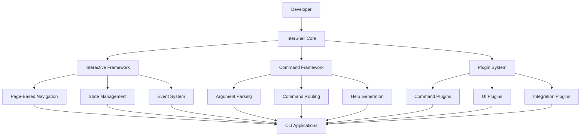

# 🚀 InterShell: Interactive CLI Framework Planning

> **Comprehensive planning and architecture for the next generation of shell utilities and interactive CLI frameworks**

## 📋 Table of Contents

- [Overview](#-overview)
- [Planning Documents](#planning-documents)
- [Architecture Vision](#architecture-vision)
- [Current Status](#current-status)
- [Next Steps](#next-steps)

## 🎯 Overview

InterShell represents the next evolution of our shell utilities and CLI framework systems. It provides a unified, type-safe, and extensible foundation for building interactive command-line applications with modern development practices.

### **Key Objectives**

1. **🎮 Generic Interactive CLI Framework**: Reusable framework for any CLI application
2. **🔧 Enhanced Script Development**: Improved script creation and management
3. **🏗️ Modular Architecture**: Clean separation of concerns and better reusability
4. **📊 Advanced State Management**: Predictable state transitions and data flow
5. **🚀 Performance Optimization**: Bun-optimized with no external dependencies
6. **🧪 Comprehensive Testing**: Full test coverage with mocking support

## 📚 Planning Documents

### **Core Architecture**

- **[🚀 InterShell Architecture](./INTERSHELL_ARCHITECTURE.md)** - Comprehensive architecture vision and design principles
- **[🎮 CLI Framework Migration](./CLI_FRAMEWORK_MIGRATION.md)** - Migration plan from current interactive CLI system

### **Related Planning**

- **[Shell v2 & Entities v2 Planning](../20_SHELL_ENTITIES_V2_PLANNING.md)** - Broader shell system upgrade planning
- **[Scripting Guide](../../4_SCRIPTING.md)** - Current scripting system documentation
- **[Development Flows](../../3_DEV_FLOWS.md)** - Development workflow documentation

## 🏗️ Architecture Vision

### **High-Level Architecture**

### **Core Components**

#### **1. InterShell Core (`@intershell/core`)**
- **Colorify**: Enhanced terminal color utilities
- **WrapShell**: Improved script creation framework
- **CLI Tools**: Advanced CLI utility functions
- **Types**: Shared type definitions

#### **2. Interactive Framework (`@intershell/interactive`)**
- **Framework**: Core interactive CLI framework
- **Pages**: Page-based navigation system
- **Navigation**: Navigation logic and state
- **State**: State management and persistence
- **Events**: Event system and middleware
- **Renderers**: Output renderers (console, HTML, etc.)

#### **3. Command Framework (`@intershell/command`)**
- **Parser**: Advanced argument parsing
- **Router**: Command routing and execution
- **Commands**: Command definitions and handlers
- **Help**: Help generation and documentation
- **Completion**: Auto-completion system

#### **4. Plugin System (`@intershell/plugin`)**
- **Manager**: Plugin lifecycle management
- **Loader**: Plugin loading and discovery
- **Registry**: Plugin registry and metadata
- **Types**: Plugin type definitions

## 📊 Current Status

### **✅ Completed**

- **Planning Documentation**: Comprehensive architecture and migration planning
- **Current System Analysis**: Understanding of existing interactive CLI system
- **CLI Framework Research**: Analysis of existing CLI frameworks and patterns

### **🔄 In Progress**

- **Architecture Design**: Detailed component design and interfaces
- **Migration Planning**: Step-by-step migration from current system

### **❌ Not Started**

- **Core Package Development**: Implementation of InterShell core packages
- **Framework Implementation**: Interactive CLI framework development
- **Migration Execution**: Actual migration from current system
- **Testing and Validation**: Comprehensive testing of new framework

## 🚀 Next Steps

### **Immediate Actions (Week 1)**

1. **Review Architecture**: Team review of InterShell architecture design
2. **Finalize Migration Plan**: Complete CLI framework migration planning
3. **Resource Allocation**: Assign developers to specific components

### **Short Term (Weeks 2-4)**

1. **Create Package Structure**: Set up `@intershell/` monorepo packages
2. **Implement Core Utilities**: Develop foundation utilities (colorify, types)
3. **Start Framework Development**: Begin interactive framework implementation

### **Medium Term (Months 2-3)**

1. **Complete Core Framework**: Finish interactive CLI framework
2. **Implement Command System**: Develop command parsing and routing
3. **Create Plugin System**: Build extensible plugin architecture

### **Long Term (Months 4-6)**

1. **Framework Integrations**: React, Vue, Svelte integrations
2. **Advanced Features**: State persistence, advanced renderers
3. **Documentation and Examples**: Comprehensive documentation and examples

## 🔗 Related Documentation

### **Current System**

- **[Scripting Guide](../../4_SCRIPTING.md)** - Current scripting system
- **[Development Flows](../../3_DEV_FLOWS.md)** - Development workflows
- **[Auto Versioning](../../7_AUTO_VERSIONING.md)** - Version management system

### **Planning Documents**

- **[Shell v2 Planning](../20_SHELL_ENTITIES_V2_PLANNING.md)** - Shell system upgrade
- **[Changelog Management](../18_CHANGELOG_MANAGEMENT.md)** - Changelog system
- **[YAML Dependency Removal](../19_YAML_DEPENDENCY_REMOVAL.md)** - YAML parser replacement

### **Environment Management**

- **[Environment Variables](../environment/9_ENVIRONMENT_VARIABLES.md)** - Environment management
- **[Enterprise Implementation](../environment/11_ENTERPRISE_ENV_IMPLEMENTATION.md)** - Enterprise solutions
- **[ZITADEL Authentication](../environment/13_HASHICORP_VAULT_ZITADEL_IMPLEMENTATION.md)** - Authentication system

## 🎯 Success Metrics

### **Technical Metrics**

- [ ] **100% Type Safety**: All components have proper TypeScript types
- [ ] **95% Test Coverage**: Comprehensive test coverage for all components
- [ ] **2x Performance**: Significant performance improvements over current system
- [ ] **Zero Breaking Changes**: Maintain backward compatibility where possible

### **Developer Experience Metrics**

- [ ] **Framework Reusability**: Framework can be used for multiple CLI applications
- [ ] **Plugin Ecosystem**: Extensible plugin system with community contributions
- [ ] **Documentation Quality**: Comprehensive API documentation and examples
- [ ] **Migration Success**: Successful migration from current interactive CLI system

---

**InterShell Planning**: This directory contains comprehensive planning and architecture documents for the next generation of shell utilities and interactive CLI frameworks, designed to be modular, extensible, and developer-friendly.
